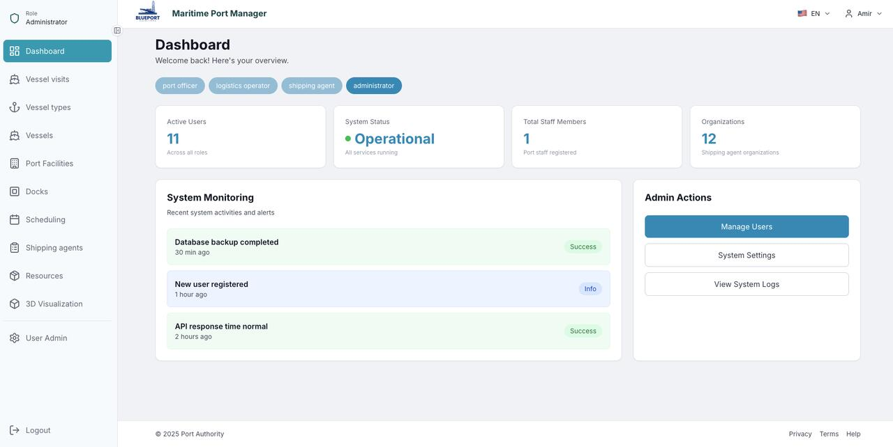
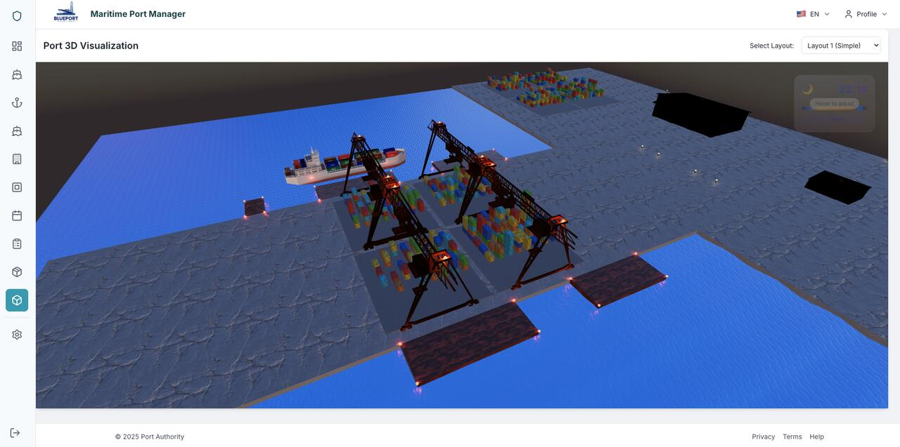

# Port Logistics Management System ⚓🚢

[](https://dotnet.microsoft.com/)
[](https://learn.microsoft.com/dotnet/csharp/)
[](https://www.typescriptlang.org/)
[](https://learn.microsoft.com/ef/core/)
[](https://www.swi-prolog.org/)
[]()

> **Context:** Academic group project for the **Integrative Project (PI)** and **Artificial Intelligence (IARTI)** courses at **ISEP**, 2025/26. A full-stack maritime port management platform combining a Domain-Driven .NET backend, a role-based TypeScript SPA with real-time 3D visualization, and an AI-based scheduler.



## 📖 Project Overview

**Port Logistics Management System** manages the back-office of a maritime port: staff and qualifications, operational resources, docks and storage areas, vessels and vessel types, shipping agents, and vessel-visit notifications (cargo, crew, and decision logs).

It pairs a well-structured enterprise backend with an **AI optimization layer** that schedules port operations, and a frontend that gives each user role its own scoped workspace — including an interactive **3D view of the port**.

## ✨ Key Features

* **🔐 Role-Based Access:** Four distinct roles — Port Officer, Logistics Operator, Shipping Agent, and Administrator — each with its own scoped dashboard and actions.
* **🚢 Port Operations:** Manage vessel visits, vessel types, vessels, docks, port facilities, storage areas, resources, and shipping agents.
* **🌐 Real-Time 3D Visualization:** An interactive 3D scene of the port (vessels, cranes, containers, docks) with selectable layouts.
* **🧠 AI Scheduling:** Port-operations scheduling solved with a **genetic algorithm** implemented in Prolog.
* **🌍 Internationalization:** Multi-language user interface.

## 🛠️ Tech Stack

| Layer | Technology |
| :--- | :--- |
| **REST API** | C# / **.NET 9** (ASP.NET Core) — Domain-Driven Design (aggregates, value objects, repositories) |
| **Persistence** | **Entity Framework Core** + SQLite (code-first migrations) |
| **Frontend** | **TypeScript** SPA — role-based UI, 3D visualization, i18n |
| **AI / Optimization** | **Prolog** — genetic-algorithm scheduler + rebalancing, served via a Prolog scheduling server |
| **Quality** | Unit, integration, and system test projects (`dotnet test`) |
| **API Docs** | Swagger / OpenAPI |

### 🧩 Domain (DDD)
Aggregates, each with its own REST controller and repository: `StaffMember`, `Qualification`, `Resource`, `Dock`, `StorageArea`, `VesselType`, `Vessel`, `ShippingAgentOrganization`, `ShippingAgentRepresentative`, `VesselVisitNotification`.

### 🧠 AI Scheduling
The scheduling problem (assigning port operations to resources and time slots) is solved in Prolog with a **genetic algorithm** (`ga_scheduling.pl`) plus a rebalancing strategy (`rebalancing_scheduling.pl`), exposed to the .NET application through a Prolog scheduling server (`scheduling_server.pl`).

### 🌐 3D Visualization


## 🙋 My Contribution
<!-- TODO Amir: replace with 2–4 specific, honest bullets. On a 5-person team this is the most important
     section for a recruiter — say exactly what YOU built. Examples:
     * Designed the `Vessel` and `VesselVisitNotification` aggregates and their REST controllers.
     * Implemented the EF Core repositories and database migrations.
     * Built the Prolog genetic-algorithm scheduler / the 3D visualization / the role-based access.
     * Wrote the integration tests for X. -->

## 🚀 Getting Started

**Backend (API):**
```bash
dotnet restore
dotnet run --project PortProject.Api    # Swagger UI at https://localhost:{PORT}/swagger (Development)
dotnet test                              # run unit, integration, and system tests
```

**Frontend (SPA):**
```bash
cd port-spa-app
npm install
npm run dev
```

Default persistence is a local SQLite file (`portproject.db`); see `appsettings.json` to change the connection string. Manage the schema with EF Core migrations:
```bash
dotnet ef database update --project PortProject.Api --startup-project PortProject.Api
```

## 👥 Team
Pedro Santos · Amir Masnavi · Leonor Marinho · Inês Oliveira · Mariana Sarmento

## 📬 Contact
* **LinkedIn:** [Amir Masnavi](https://www.linkedin.com/in/amir-masnavi-b1ab61293/)
* **Portfolio:** [AmirMasnavi.github.io](https://amirmasnavi.github.io/)

## 📄 License
Academic project. Please contact the repository owner regarding any reuse.
