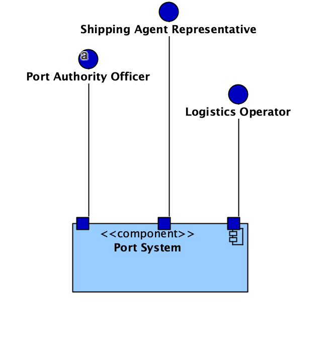
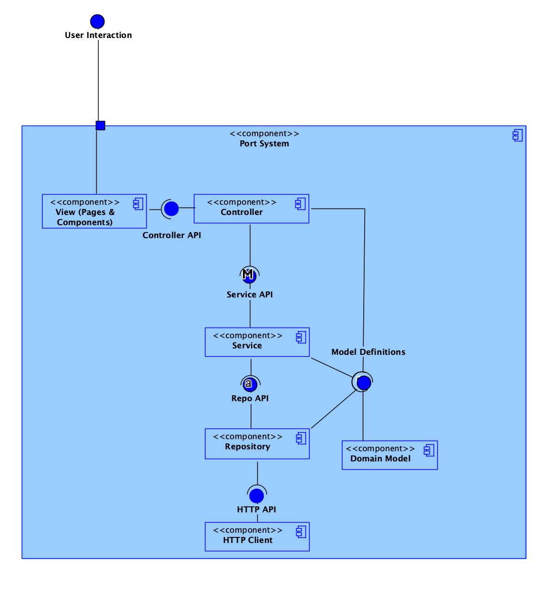
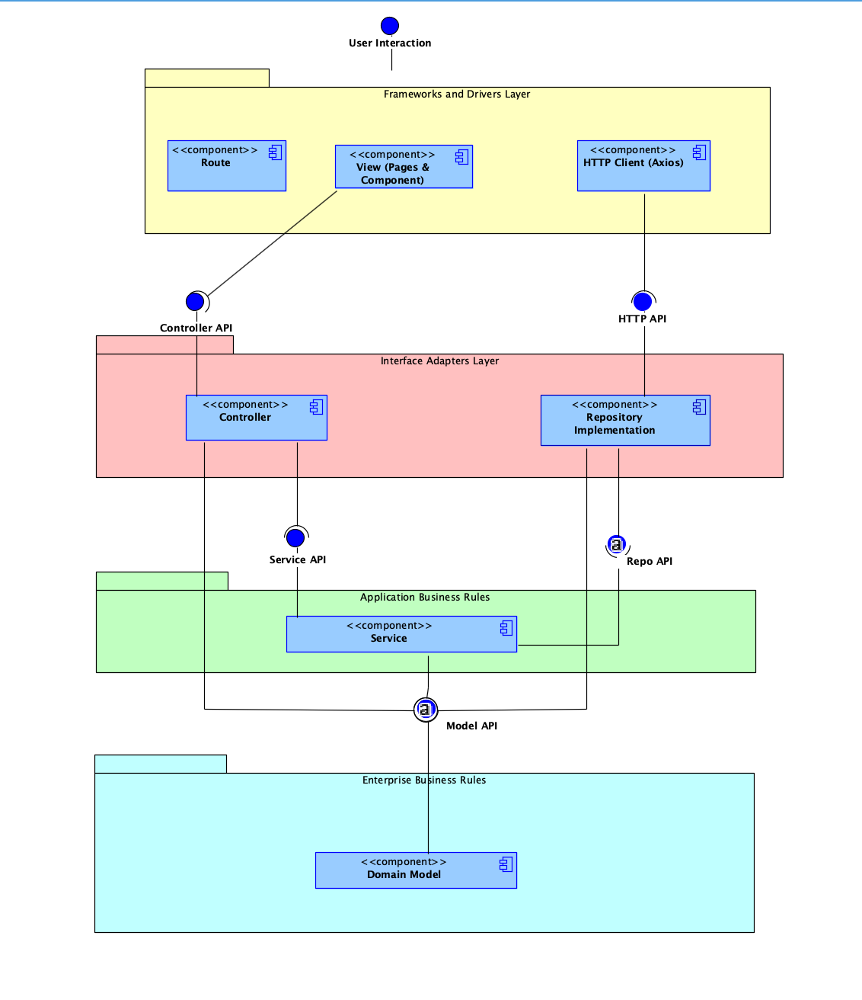
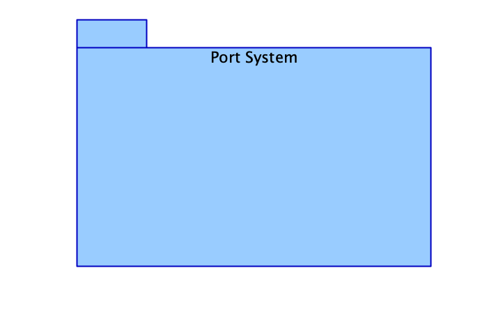
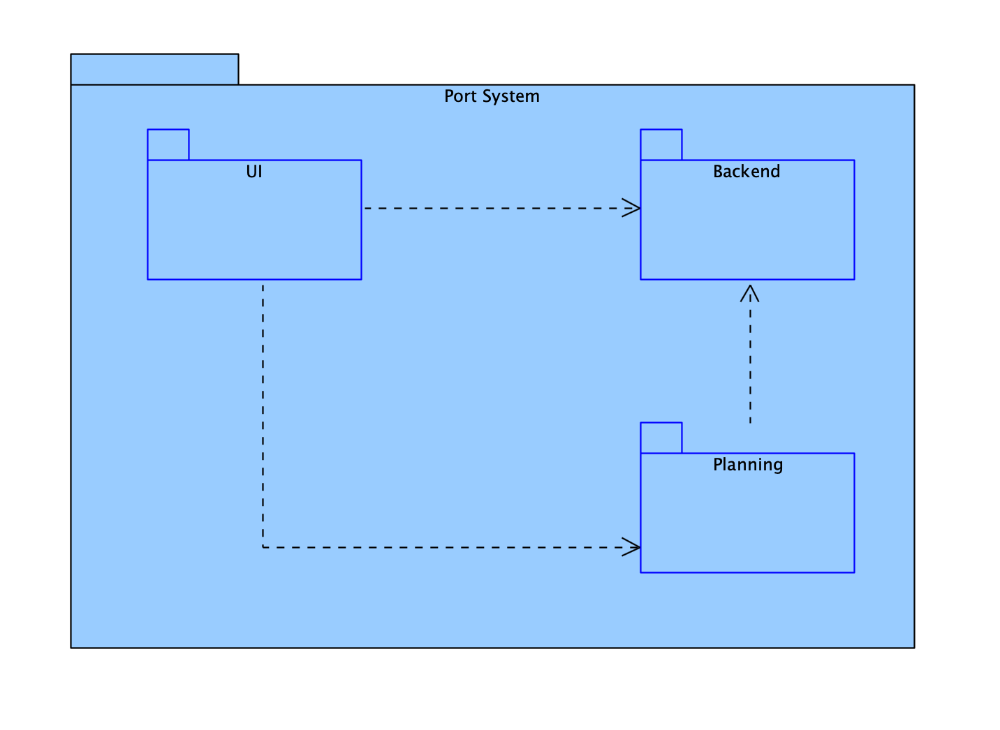
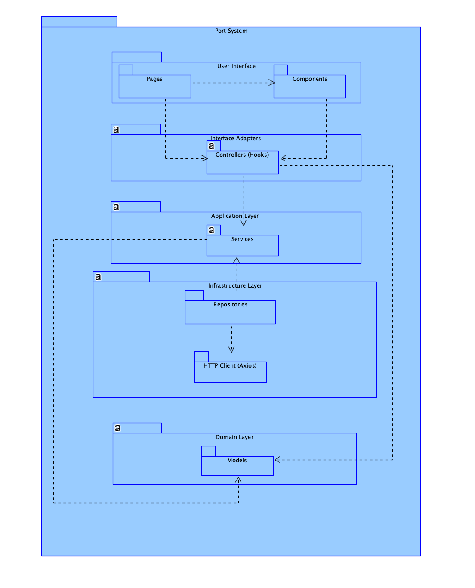
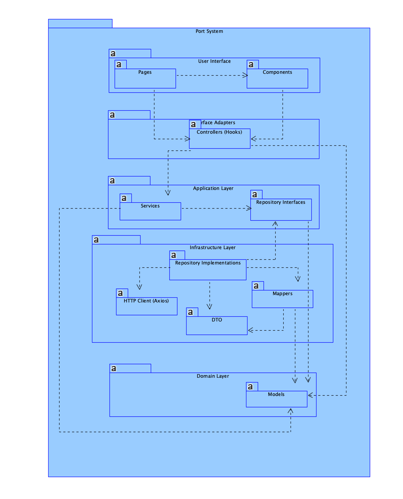
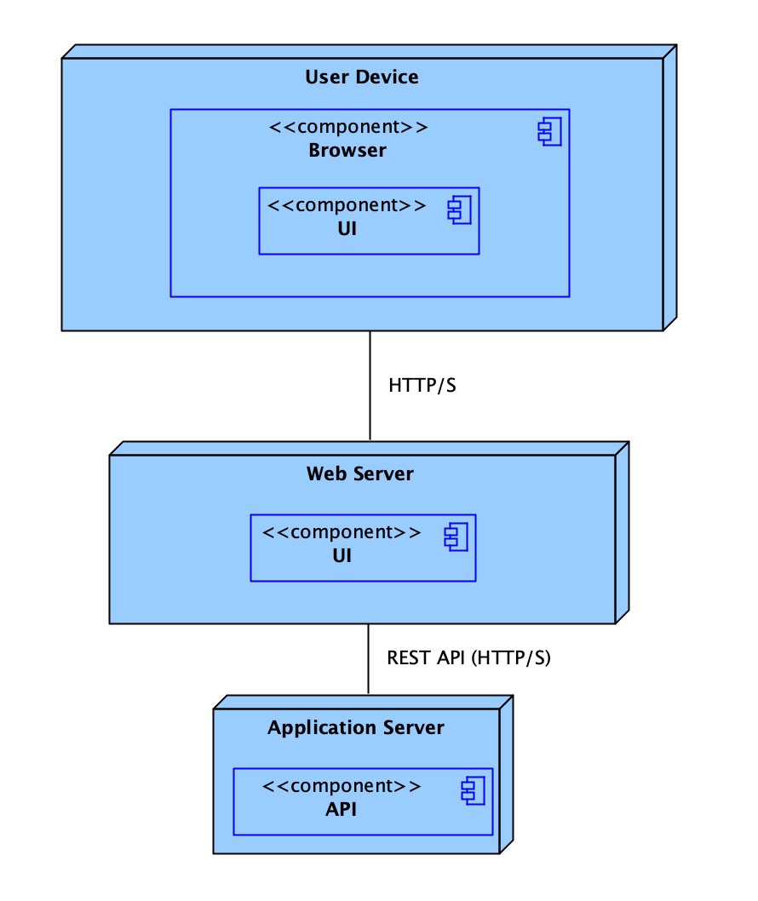

# 📐 Architecture Diagrams - Sprint B

This document presents all system architecture diagrams developed during Sprint B, organized according to Kruchten's **4+1 Views Model**.

## 📑 Table of Contents

- [Logical View](#logical-view)
- [Implementation View](#implementation-view)
- [Physical View](#physical-view)
- [Process View](#process-view)

---

## 🧩 Logical View

The **Logical View** describes the system structure in terms of components, classes and their relationships, focusing on functional decomposition.

### Level 1 - System Context View

**Description:** Shows the different actors (Port Authority Officer, Logistics Operator, Shipping Agent Representative) and their interaction with the system.

- **Source file:** `LogicViewDiagrams/Diagram_N1.vpp`

---

### Level 2 - Main Component Architecture

**Description:** Details the Port System architecture, showing the visualization UI layer, Backend and Planning.

- **Source file:** `LogicViewDiagrams/Diagram_N2.vpp`

---

### Level 3 - Detailed Component Decomposition

**Description:** Deep dives into the internal structure of components, showing the separation between View (Pages & Components), Controller, Service, Repository, HTTP Client and Domain Model.

- **Source file:** `LogicViewDiagrams/Diagram_N3.vpp`

---

### Level 3 (Onion Architecture) - Layered Architecture

**Description:** Represents the system's Onion (Clean Architecture), separating layers into: Frameworks and Drivers Layer (Route, View, HTTP Client), Interface Adapters Layer (Controller, Repository Implementation), Application Business Rules (Service) and Enterprise Business Rules (Domain Model).

- **Source file:** `LogicViewDiagrams/Diagram_N3_Onion.vpp`

---

### Level 4 - Class and Interface Details

**Description:** Shows the most detailed level of logical architecture, including API interfaces (Controller API, Service API, Repo API, HTTP API, Model API) and their dependencies. Adds Repository Interface, Data Mapper, and DTO relative to level 3.

- **Source file:** `LogicViewDiagrams/Diagram_N4.vpp`

---

## 🔧 Implementation View

The **Implementation View** shows the organization of source code, modules, libraries and dependencies.

### Level 1 - High-Level Module Organization

**Description:** System overview.

- **Source file:** `ImplementationViewDiagrams/Diagram_N1.vpp`

---

### Level 2 - Package Structure and Dependencies

**Description:** Details the system's package structure, dividing it into UI, Backend and Planning.

- **Source file:** `ImplementationViewDiagrams/Diagram_N2.vpp`

---

### Level 3 - Internal Package Organization

**Description:** Shows the detailed organization within each main system package.

- **Source file:** `ImplementationViewDiagrams/Diagram_N3.vpp`

---

### Level 4 - Component Implementation Details

**Description:** Most granular level showing the concrete implementation of individual components.

- **Source file:** `ImplementationViewDiagrams/Diagram_N4.vpp`

---

## 🌐 Physical View

The **Physical View** describes the mapping of software to hardware, including servers, networks and deployment infrastructure.

### Level 2 - Deployment Topology

**Description:** Shows the system's physical infrastructure, including frontend, backend servers and external services.

- **Source file:** `PhysicalView/Diagram_N2.vpp`

---

## 🔄 Process View

The **Process View** shows the system's dynamic behavior, including execution flows, concurrency and inter-process communication.

### Authentication and Authorization Flow

#### Authorization Overview Diagram

**Description:** Detailed sequence diagram showing the authentication flow using OAuth2/OIDC with Authorization Code + PKCE. Includes:
- User login through Identity Provider (IAM)
- Exchange of authorization code for tokens (access_token, id_token, refresh_token)
- Secure storage of tokens in the frontend
- Token validation in the backend via JWKS or Token Introspection
- Protected requests with Bearer token

- **PlantUML source file:** [puml/authorization-overview.puml](ProcessViewDiagrams/US2.2.1/puml/authorization-overview.puml)

**Components involved:**
- **Frontend System:** Web Client (SPA/Browser), Local Storage/Memory
- **Backend System:** HTTP Request, Route/Middleware, Auth Controller, Auth Service, Token Validator, User Repository
- **Identity Provider (IAM):** Authorization Endpoint, Token Endpoint, JWKS/Introspection

**Main flow:**
1. User clicks "Login" → Redirect to IAM `/authorize`
2. User authenticates on IAM
3. IAM redirects with authorization code
4. SPA exchanges code for tokens at `/token` endpoint
5. Tokens stored securely
6. Subsequent requests include `Authorization: Bearer <access_token>`
7. Backend validates token via JWKS/Introspection
8. Request processed with user context

---

#### Frontend Overview Diagram

**Description:** Complete sequence diagram of the frontend application (SPA) lifecycle, including:
- Initial app load and Service Worker (offline cache)
- Bootstrap and authentication verification
- OAuth2/OIDC login flow with IAM
- Navigation and data fetching with Bearer token
- Automatic refresh of expired tokens
- Real-time updates via WebSocket
- Logout and token revocation

- **PlantUML source file:** [puml/frontend-overview.puml](ProcessViewDiagrams/US2.2.1/puml/frontend-overview.puml)

**Components involved:**
- **User & Browser:** End User, Browser SPA Shell
- **Single Page App (Frontend):** Router Views, Auth Service, State Store, API Client HTTP, Service Worker Cache, Local Storage/IndexedDB, WebSocket Client
- **Backend & Identity:** API Gateway Backend, Identity Provider IAM, Realtime Server WS

**Main flows:**

1. **App Load & Cache (1-1.4):**
   - Service Worker checks cache
   - Loads assets from cache or server

2. **Bootstrap & Auth Check (2-2.6):**
   - Router initializes
   - Auth Service checks stored tokens
   - Redirects to Dashboard (authenticated) or Login (not authenticated)

3. **Login Flow (3-3.14):**
   - Redirect to IAM (PKCE)
   - Authentication on IAM
   - Exchange code for tokens
   - Fetch user profile
   - Store update and redirection

4. **Data Fetching (4-4.5):**
   - Navigation to sections (Vessels, Ops, Planning)
   - API Client fetches resources with Bearer token
   - Store updated → Views re-render

5. **Token Refresh (5-5.4):**
   - Detection of expired token (401)
   - Automatic refresh via refresh_token
   - Transparent retry of original request

6. **Realtime Updates (6-6.3):**
   - Authenticated WebSocket
   - Server push events
   - Automatic UI update

7. **Logout (7-7.4):**
   - Clear state and storage
   - Token revocation on IAM
   - Redirect to Login

    
---

## 📊 Diagrams Summary

| View | Levels | Tool | Available Formats |
|-------|--------|------------|-------------------|
| **Logical View** | N1, N2, N3, N3 (Onion), N4 | Visual Paradigm | PNG |
| **Implementation View** | N1, N2, N3, N4 | Visual Paradigm | PNG |
| **Physical View** | N2 | Visual Paradigm | PNG |
| **Process View** | (2 diagrams) | PlantUML | SVG |

---

## 📚 References

- [C4 Model for visualising software architecture](https://c4model.com/)
- [4+1 Architectural View Model - Kruchten](https://en.wikipedia.org/wiki/4%2B1_architectural_view_model)
- [PlantUML Official Documentation](https://plantuml.com/)
- [OAuth 2.0 with PKCE](https://oauth.net/2/pkce/)
- [OpenID Connect (OIDC)](https://openid.net/connect/)

---

**Sprint:** B  
**Team:** 3DL-02
