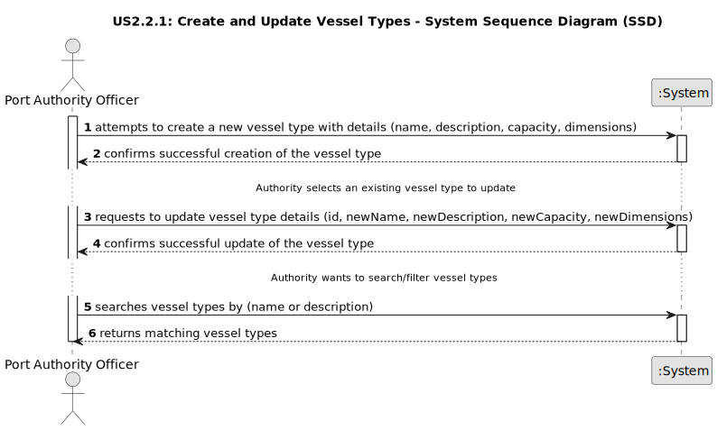

# US2.2.1 - Create and Update Vessel Types

## 1. Requirements Engineering

### 1.1. User Story Description

As a Port Authority Officer, I want to create and update vessel types, so that vessels can be classified consistently and their operational constraints are properly defined.

### 1.2. Customer Specifications and Clarifications

**From the specifications document:**

> Ports receive a wide variety of vessels, ranging from small feeder ships to large ocean-going container vessels. Each vessel is uniquely identified by an IMO (International Maritime Organization) number, which serves as its international registration and is linked to national or regional maritime authorities. The size, type, and cargo capacity of a vessel strongly influence its operational needs at the port, such as the length of dock required, the number of STS cranes that can be engaged, and the volume of containers to be handled. (Section 3.1.3 Vessels, Page 4)
>
> Although ports handle many vessel categories, the system will focus mainly on container-carrying vessels, since they are the most common in modern commercial ports. Examples include feeder vessels (...), Panamax vessels (...), Post-Panamax vessels (...), and Ultra Large Container Vessels (ULCVS) (...). (Section 3.1.3 Vessels, Page 4)
>
> Cargo on these vessels is stored in containers, which may vary in size (e.g., 20-foot, 40-foot). To simplify, the prototype will adopt the TEU (Twenty-foot Equivalent Unit) as the standard measurement, assuming all containers have the same dimension. Containers are organized into a grid-like structure on board, divided into bays (lengthwise sections of the ship), rows (across the width), and tiers (vertical stacks above and below deck). The type of vessel determines the maximum number of rows, bays, and tiers, and therefore its maximum TEU capacity. (Section 3.1.3 Vessels, Page 4)

### 1.3. Acceptance Criteria

*   **AC1:** Vessel types must include attributes such as name, description, capacity (in TEUs), and operational constraints (e.g., maximum number of rows, bays, and tiers).
*   **AC2:** The system must allow the Port Authority Officer to create new vessel types by providing the required attributes.
*   **AC3:** The system must allow the Port Authority Officer to update existing vessel types by modifying their attributes.
*   **AC4:** Vessel types must be available for reference when registering new vessel records.
*   **AC5:** Vessel types must be searchable by name and description.
*   **AC6:** Vessel types must be filterable by name and description.

### 1.4. Found out Dependencies

*   This user story is a prerequisite for US2.2.2 "As a Port Authority Officer, I want to register and update vessel records," as vessel records depend on predefined vessel types.
*   The system will need a data persistence layer to store and retrieve vessel type information.
*   The user interface (UI) for the Port Authority Officer will need to include forms for creating and updating vessel types, as well as search and filter functionalities.

### 1.5 Input and Output Data

**Input Data (Create Vessel Type):**

*   `name` (string): Unique name for the vessel type (e.g., "Feeder Vessel", "ULCV").
*   `description` (string): Detailed description of the vessel type.
*   `capacity` (integer): Maximum TEU capacity.
*   `maxRows` (integer): Maximum number of rows for containers.
*   `maxBays` (integer): Maximum number of bays for containers.
*   `maxTiers` (integer): Maximum number of tiers for containers.

**Output Data (Create Vessel Type):**

*   Successful creation: Confirmation message and the newly created vessel type's details.
*   Failed creation: Error message (e.g., "Vessel type with this name already exists," "Invalid input data").

**Input Data (Update Vessel Type):**

*   `id` (string/integer): Unique identifier of the vessel type to be updated.
*   `newName` (string, optional): New name for the vessel type.
*   `newDescription` (string, optional): New description.
*   `newCapacity` (integer, optional): New maximum TEU capacity.
*   `newMaxRows` (integer, optional): New maximum number of rows.
*   `newMaxBays` (integer, optional): New maximum number of bays.
*   `newMaxTiers` (integer, optional): New maximum number of tiers.

**Output Data (Update Vessel Type):**

*   Successful update: Confirmation message and the updated vessel type's details.
*   Failed update: Error message (e.g., "Vessel type not found," "Invalid update data").

**Input Data (Search/Filter Vessel Types):**

*   `keyword` (string, optional): Text to search in name or description.
*   `filterCriteria` (string, optional): Criteria to filter by (e.g., part of name, part of description).

**Output Data (Search/Filter Vessel Types):**

*   `vesselTypes` (list of objects): A list of vessel types matching the search/filter criteria, each with its `id`, `name`, `description`, `capacity`, `maxRows`, `maxBays`, and `maxTiers`.
*   No matches: Empty list or appropriate message.

### 1.6. System Sequence Diagram (SSD)

The following SSD illustrates the generic flow for creating, updating, and searching/filtering vessel types.

