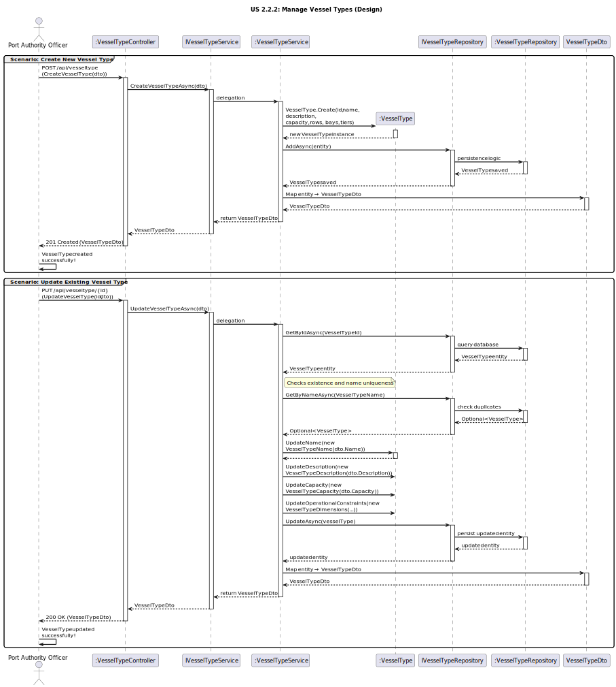

# US2.2.1 - Create and Update Vessel Types

## 3. Design - User Story Realization

### 3.1. Rationale

| Interaction ID (Inferred SSD Step)                                            | Question: Which class is responsible for...                                           | Answer                         | Justification (with patterns)                                                                                                                                              |
|:------------------------------------------------------------------------------|:--------------------------------------------------------------------------------------|:--------------------------------|:---------------------------------------------------------------------------------------------------------------------------------------------------------------------------|
| **Scenario: Create Vessel Type**                                              |                                                                                        |                                 |                                                                                                                                                                            |
| Step 1 (Officer requests to create a vessel type)                             | ... interacting with the actor to create a new vessel type?                            | `VesselTypeController`          | **Controller / Pure Fabrication:** Handles the HTTP request and coordinates the creation flow between layers.                                                              |
|                                                                               | ... receiving input data and converting it to a transferable object?                   | `VesselTypeDto`                 | **Information Expert (IE):** Encapsulates transferable data between presentation and application layers.                                                                   |
| Step 2 (System processes creation)                                            | ... coordinating the creation logic?                                                   | `VesselTypeService`             | **Controller / Application Service:** Orchestrates the use case, applies business rules, and delegates persistence.                                                        |
|                                                                               | ... defining the rules and structure of a vessel type?                                 | `VesselType`                    | **Domain Entity / Information Expert (IE):** Encapsulates attributes and behaviors (name, description, capacity, operational constraints).                                 |
|                                                                               | ... persisting the new vessel type?                                                    | `VesselTypeRepository`          | **Repository (DDD Pattern):** Responsible for saving and retrieving domain aggregates.                                               |
|                                                                               | ... abstracting persistence operations?                                                | `IVesselTypeRepository`         | **Interface Segregation / Pure Fabrication:** Defines repository contracts, enabling decoupling between service and persistence implementation.                            |
|                                                                               | ... creating a new instance of the entity?                                             | `VesselType`                    | **Creator Pattern:** The entity creates itself through a static factory (`VesselType.Create()`) ensuring validity and invariants.                                          |
| Step 3 (System responds)                                                      | ... mapping the entity back to a DTO to return to the user?                            | `VesselTypeService` / `Mapper`  | **Pure Fabrication:** Handles entity-to-DTO conversion, isolating transformation logic.                                               |
|                                                                               | ... sending the confirmation of creation to the user?                                  | `VesselTypeController`          | **Information Expert (IE):** Returns the HTTP response (201 Created) with the created `VesselTypeDto`.                              |
| **Scenario: Update Vessel Type**                                              |                                                                                        |                                 |                                                                                                                                                                            |
| Step 1 (Officer requests to update a vessel type)                             | ... handling the update request from the actor?                                        | `VesselTypeController`          | **Controller / Adapter:** Adapts external HTTP requests to internal service calls.                                                   |
| Step 2 (System validates and updates entity)                                  | ... locating the existing vessel type?                                                 | `VesselTypeRepository`          | **Information Expert (IE):** Knows how to find existing records by ID.                                                              |
|                                                                               | ... ensuring no duplicate vessel type names exist?                                     | `VesselTypeService`             | **Information Expert (IE):** Applies business rules for name uniqueness.                                                            |
|                                                                               | ... performing the actual update of attributes (name, description, etc.)?              | `VesselType`                    | **Information Expert (IE):** Owns its own data and is responsible for maintaining consistency when updated.                          |
|                                                                               | ... persisting the modified entity?                                                    | `VesselTypeRepository`          | **Repository:** Responsible for saving updated domain objects.                                                                      |
| Step 3 (System responds)                                                      | ... preparing and returning the updated vessel type data?                              | `VesselTypeService` / `Mapper`  | **Pure Fabrication:** Converts the updated entity into a DTO for API response.                                                      |
|                                                                               | ... sending confirmation of the update to the actor?                                   | `VesselTypeController`          | **Information Expert (IE):** Sends a 200 OK response with updated vessel type details.                                               |

---

### Systematization

According to the rationale, the following conceptual classes were promoted to software classes in the system:

#### **Domain Layer**
- `VesselType` – Entity representing a vessel type and its operational constraints (rows, bays, tiers, capacity, description, name).

#### **Application Layer**
- `IVesselTypeService` – Defines service operations for managing vessel types.
- `VesselTypeService` – Implements business logic, coordinates domain and persistence, and performs validation.

#### **Infrastructure Layer**
- `IVesselTypeRepository` – Interface defining persistence operations for vessel types.
- `VesselTypeRepository` – Implements the data access layer for vessel types.

#### **Presentation Layer**
- `VesselTypeController` – Handles HTTP requests (Create, Update, Search, Delete) and sends appropriate responses.
- `VesselTypeDto` – Data Transfer Object for exchanging data between client and API.

---

### Full Diagram

The following diagram shows the complete design realization for the *Manage Vessel Types* user story (covering **Create** and **Update** scenarios).

