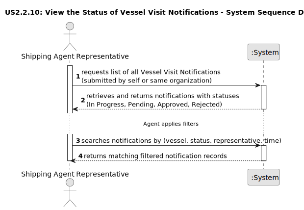

# US 2.2.10 - View the Status of Vessel Visit Notifications

## 1. Requirements Engineering

### 1.1. User Story Description

As a Shipping Agent Representative, I want to view the status of all my submitted Vessel Visit Notifications (in progress, pending, approved with current dock assignment, or rejected with reason), so that I am always informed about the decisions of the Port Authority.

### 1.2. Customer Specifications and Clarifications 

**From the specifications document:**
> A Vessel Visit represents the planned arrival and departure of a vessel at the port, including associated operations such as cargo loading and unloading. 
> The process begins when a shipping agent representative submits a Vessel Visit Notification for an authorized vessel, providing key information such as expected arrival (ETA), departure (ETD), cargo type and volume, and any special handling requirements.
>
> The Port Authority reviews the notification and decides to approve or reject it. 
> Once approved, a dock is assigned. When rejected, the representative can update and resubmit the notification for further decision.
>
>(System Specification, Section 3.1.5 – Vessel Visits)
 
**From the client clarifications:**

> **Question:** Can a representative see Vessel Visit Notifications submitted by colleagues within the same organization?
>
> **Answer:** Yes, all representatives belonging to the same shipping agent organization can view each other’s submitted notifications.

> **Question:** What information should be visible to the representative?
>
> **Answer:** Each notification’s status (In Progress, Pending, Approved, Rejected), associated vessel, dock (if approved), and rejection reason (if applicable).

> **Question:** How should the data be accessed?
>
> **Answer:** The system must allow search and filtering by vessel, status, representative, and time period.

### 1.3. Acceptance Criteria

* **AC1:** The Shipping Agent Representative must be able to view all their submitted Vessel Visit Notifications and their statuses: In Progress, Pending, Approved (with assigned dock), or Rejected (with reason).
* **AC2:** The representative must also be able to view notifications submitted by other representatives from the same shipping agent organization.
* **AC3:** Notifications must be searchable and filterable by vessel, status, representative, and time.

### 1.4. Found out Dependencies

* Depends on US 2.2.7 – Review and Approve/Reject Vessel Visit Notifications, as this story displays the results of those decisions.
* Depends on US 2.2.8 / 2.2.9 – Create and Update Vessel Visit Notifications, since those user stories create the notifications being listed here.
* Requires a data persistence layer storing notification data and decisions (status, dock, rejection reason).
* Requires role-based access control to ensure representatives only see notifications for their organization.

### 1.5 Input and Output Data

**Input Data (View Notifications):**
 * `representativeId` (string): Identifier of the Shipping Agent Representative.
 * `organizationId` (string): Identifier of the representative’s organization.
 * `filters` (object, optional):
   * `vesselId` (string, optional)
   * `status` (enum: InProgress, Pending, Approved, Rejected)
   * `representativeId` (string, optional)
   * `dateRange` (startDate, endDate, optional)

**Output Data (View Notifications):**
 * `notificationsList` (list of objects): Each notification includes:
   * `notificationId` (string)
   * `vesselName` (string)
   * `status` (enum)
   * `assignedDock` (string, optional – only if approved)
   * `rejectionReason` (string, optional – only if rejected)
   * `submittedBy` (representative name)
   * `submissionDate` (datetime)
 * No matches: Return an empty list or appropriate message.

### 1.6. System Sequence Diagram (SSD)

The following SSD illustrates the system interactions for viewing and filtering Vessel Visit Notifications by a Shipping Agent Representative.

