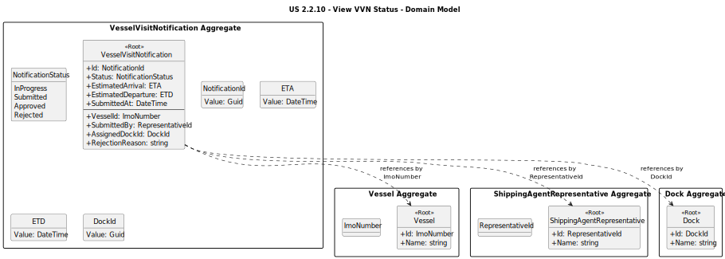

# US 2.2.10: View the Status of Vessel Visit Notifications – Analysis Domain Model

This diagram illustrates the domain model for the `VesselVisitNotification` aggregate, focusing on the attributes and relationships relevant to querying and displaying the status of submitted notifications. It reflects the read-side structure and filtering capabilities required by this user story.

## Key Domain Concepts

* **VesselVisitNotification**: This is the Aggregate Root. It encapsulates the state and metadata of a vessel visit notification. For this user story, the focus is on its current `Status`, submission metadata, and references to related aggregates such as `Vessel`, `Dock`, and `ShippingAgentRepresentative`.

* **NotificationStatus**: An enumeration that defines the lifecycle states of a notification: `InProgress`, `Submitted`, `Approved`, and `Rejected`. These values are used for filtering and display purposes.

* **Dock (by DockId)**: If the notification is approved, it includes a reference to the assigned dock. The dock name or number is displayed to the representative.

* **RejectionReason:**: A string field that is only populated when the notification has been rejected. It provides the justification from the Port Authority Officer.

* **SubmittedBy (RepresentativeId)**: Identifies the representative who submitted the notification. Used to filter by user or organization.

* **SubmissionDate**: A timestamp indicating when the notification was submitted. Used for sorting and filtering by time range.

* **Vessel (by ImoNumber)** The vessel associated with the notification. The vessel name is displayed in the results and used for filtering.

