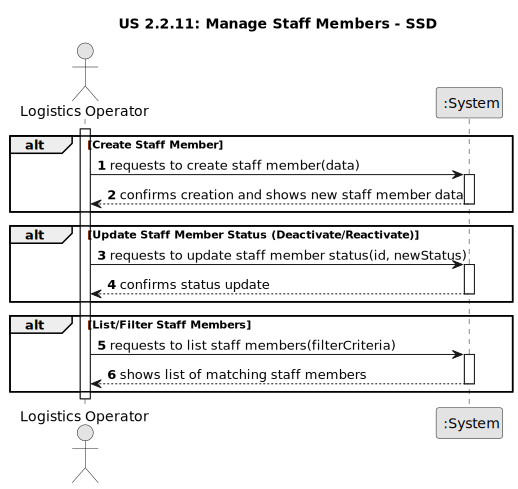

# US 2.2.11: Manage Staff Members - Requirements Engineering

## 1. Requirements Engineering

### 1.1. User Story Description

As a Logistics Operator, I want to register and manage operating staff members (create, update, deactivate), so that the system can accurately reflect staff availability and ensure that only qualified personnel are assigned to resources during scheduling.

### 1.2. Customer Specifications and Clarifications

* **Purpose:** Efficient port operations depend on the availability and proper assignment of qualified staff.
* **Required Data:** The system must capture identification (mecanographic number), contact details (short name, email, phone), weekly availability (operational window), held qualifications, and current status (e.g., available, unavailable).
* **Deactivation:** Deactivating a staff member should mark them as unavailable but preserve their data for historical and auditing purposes.
* **Scheduling Constraint:** The system should support future scheduling algorithms by ensuring resources are matched with qualified staff whose availability overlaps with the resource's operational window.

### 1.3. Acceptance Criteria

* **AC1:** Each staff member must have a unique mecanographic number (ID), short name, contact details (email, phone), qualifications, operational window, and current status (e.g., available, unavailable).
* **AC2:** The system must allow the Logistics Operator to create new staff member records.
* **AC3:** The system must allow the Logistics Operator to update existing staff member records (e.g., contact details, operational window, status, qualifications).
* **AC4:** Deactivation/reactivation must not delete staff data but preserve it for audit and historical planning purposes (Implemented via status change).
* **AC5:** Staff members must be searchable and filterable by id, name, status, and qualifications.

### 1.4. Found out Dependencies

* **US 2.2.13 (Manage Qualifications):** Qualifications must be defined in the system before they can be assigned to staff members. The system enforces this dependency.
* **Scheduling Algorithms (Future):** The data captured (operational window, qualifications, status) is essential input for future resource allocation and task sequencing algorithms mentioned in the system description.

### 1.5. Input and Output Data

**Input Data (Create Staff Member):**

* Corresponds to `CreateStaffMemberDto`.
* `MecanographicNumber` (string)
* `ShortName` (string)
* `Email` (string)
* `Phone` (string)
* `StartTime` (TimeOnly)
* `EndTime` (TimeOnly)
* `WorkingDays` (DayOfWeek[]?, optional, defaults to Mon-Fri)

**Output Data (Create Staff Member):**

* **Success:** A `StaffMemberDto` with the new staff member's details (including `CurrentStatus = "Available"`) and an HTTP 201 Created status.
* **Failure:** An HTTP 400 Bad Request if validation fails (e.g., invalid mecanographic number format, start time >= end time).

**Input Data (Update Status / Deactivate):**

* Corresponds to `UpdateStaffStatusDto`.
* `staffMemberId` (string, from URL path)
* `NewStatus` (StaffStatus enum, e.g., "Unavailable")

**Output Data (Update Status / Deactivate):**

* **Success:** A `StaffMemberDto` with the updated status and an HTTP 200 OK status.
* **Failure:** An HTTP 404 Not Found if the ID doesn't exist.

**Input Data (Add Qualification):**

* Corresponds to `AddQualificationDto`.
* `staffMemberId` (string, from URL path)
* `QualificationCode` (string)

**Output Data (Add Qualification):**

* **Success:** A `StaffMemberDto` including the added qualification code and an HTTP 200 OK status.
* **Failure:** An HTTP 404 Not Found if the staff ID doesn't exist, or HTTP 400 Bad Request if the qualification code is invalid or doesn't exist.

**Input Data (Remove Qualification):**

* `staffMemberId` (string, from URL path)
* `qualificationCode` (string, from URL path)

**Output Data (Remove Qualification):**

* **Success:** A `StaffMemberDto` without the removed qualification code and an HTTP 200 OK status.
* **Failure:** An HTTP 404 Not Found if the staff ID doesn't exist, or HTTP 400 Bad Request if the qualification code is invalid or not assigned to the staff member.

**Input Data (Search/Filter):**

* `name` (string, optional)
* `status` (StaffStatus enum, optional)
* `qualificationCode` (string, optional)

**Output Data (Search/Filter):**

* **Success:** A list of `StaffMemberDto` objects matching the criteria and an HTTP 200 OK status.

### 1.6. System Sequence Diagram (SSD)

The following SSD illustrates the key interactions for managing staff members: creating, updating status (deactivating), managing qualifications, and searching.

*(Diagram generated from [us2.2.11-ssd.puml](puml/us2.2.11-ssd.puml))*