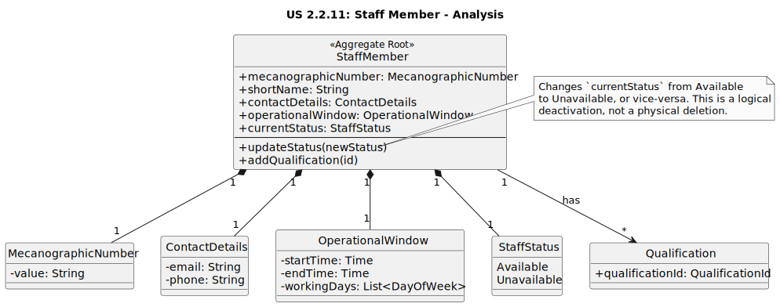

# US 2.2.11: Manage Staff Members - Analysis Domain Model

This diagram focuses on the **`StaffMember`** aggregate. It is the central entity, responsible for maintaining its own consistency and business rules. The model highlights its attributes, value objects, and its relationship with the `Qualification` aggregate.

*(Diagram generated from [us2.2.11-domain-model.puml](puml/us2.2.11-domain-model.puml))*

## Key Domain Concepts

* **StaffMember**: The **Aggregate Root** for this context. It ensures that a staff member's data is always valid and consistent. It is uniquely identified by a `MecanographicNumber`.
* **MecanographicNumber**: A **Value Object** representing the unique identifier, enforcing its format rules. Guarantees uniqueness.
* **ContactDetails**: A **Value Object** that groups the email and phone, ensuring they are treated as a single, validated unit.
* **OperationalWindow**: A **Value Object** defining the staff member's working schedule (start time, end time, working days).
* **StaffStatus**: An enum (`Available`, `Unavailable`) representing the current availability. The `deactivate` operation simply transitions this status, preserving the entity's data (**AC4**).
* **Qualification**: A separate aggregate. A `StaffMember` holds a list of references (by `QualificationCode`) to the qualifications they possess. The `StaffMember` aggregate includes methods (`AddQualification`, `RemoveQualification`) to manage this relationship, ensuring only valid, existing qualifications can be linked.