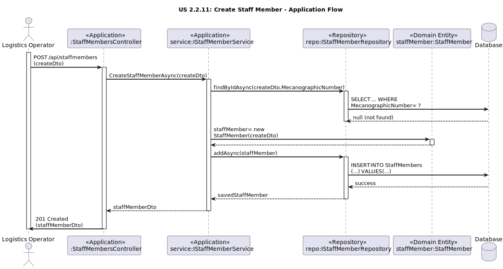
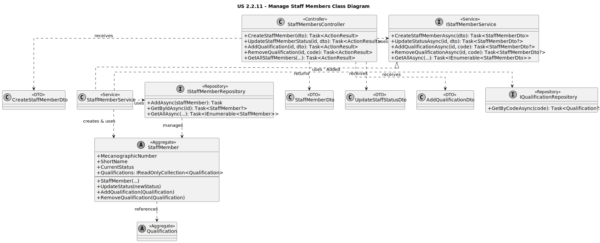

# US 2.2.11: Manage Staff Members - Design

## 3.1. Rationale

The design employs a standard layered architecture, separating concerns effectively. Controllers handle HTTP requests, Services orchestrate the use case, Repositories manage data persistence, and Domain entities encapsulate business logic and state.

| Interaction | Question: Which class is responsible for... | Answer | Justification (with patterns) |
| :--- | :--- | :--- | :--- |
| **Step 1 (Receive Request)** | ...handling the HTTP request (`POST`, `PATCH`, `DELETE`, `GET`)? | `StaffMembersController` | **Controller (GRASP):** Acts as the entry point, receiving HTTP requests, validating DTOs, and delegating to the application service. |
| **Step 2 (Orchestrate)** | ...coordinating the creation, status update, qualification management, or search? | `StaffMemberService` | **Service Layer / Pure Fabrication:** Orchestrates the use case flow. It uses the repository to fetch/save data and calls methods on the domain aggregate (`StaffMember`) to perform actions like status updates or qualification changes. |
| | ...finding the `StaffMember` aggregate? | `IStaffMemberRepository` | **Repository:** Abstracts data access logic for `StaffMember` aggregates. Used by the service to retrieve staff members by ID or based on search criteria. |
| | ...finding the `Qualification` aggregate (when adding/removing)? | `IQualificationRepository` | **Repository:** Used by the `StaffMemberService` to verify that a `Qualification` exists before adding it to a `StaffMember`. |
| **Step 3 (Execute Logic)** | ...creating a `StaffMember` and ensuring its initial state is valid? | `StaffMember` (Aggregate) | **Information Expert (GRASP):** The aggregate root's constructor ensures required fields are provided and sets the initial `CurrentStatus` to `Available`. |
| | ...validating and changing the `CurrentStatus`? | `StaffMember` (Aggregate) | **Information Expert (GRASP):** The `UpdateStatus` method within the aggregate enforces any rules about status transitions (though currently simple). |
| | ...adding or removing a `Qualification` reference? | `StaffMember` (Aggregate) | **Information Expert (GRASP):** The `AddQualification` and `RemoveQualification` methods manage the internal list of qualifications, preventing duplicates if necessary. |
| **Step 4 (Persist State)** | ...saving the new or modified `StaffMember` aggregate? | `IStaffMemberRepository` (via `DbContext`) | **Repository / Unit of Work:** Changes made to the aggregate fetched by the service are tracked by the `DbContext` and saved when `SaveChangesAsync` is called. |
| **Step 5 (Send Response)** | ...transforming the domain entity/entities into DTOs for the response? | `StaffMemberService` | **Service Layer / DTO:** Maps the `StaffMember` aggregate(s) to `StaffMemberDto` before returning the result to the controller. |

## 3.2. Sequence Diagram (SD)

This diagram illustrates the **Create Staff Member** scenario, showing the collaboration between the layers. Other operations like updating status or managing qualifications follow similar patterns.

*(Diagram generated from [us2.2.11-sequence-diagram.puml](puml/us2.2.11-sequence-diagram.puml))*

## 3.3. Class Diagram (CD)

This diagram shows the main classes and interfaces involved in implementing this use case, reflecting the C# project structure.

*(Diagram generated from [us2.2.11-class-diagram.puml](puml/us2.2.11-class-diagram.puml))*