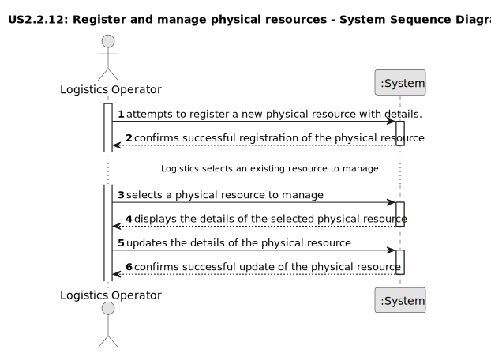

# US2.2.12 - Register and manage physical resources

## 1. Requirements Engineering

### 1.1. User Story Description

As a Logistics Operator, I want to register and manage physical resources (create, update, deactivate), so that they can be accurately considered during planning and scheduling operations.

### 1.2. Customer Specifications and Clarifications

**From the specifications document:**

> The Logistics Operator is the user responsible for creating, updating, and deactivating physical resources.
>
>  The functionality must enable the management of various pieces of equipment directly involved in ship and yard operations.
>
> Each resource must have a unique alphanumeric code for unambiguous identification in the system.

### 1.3. Acceptance Criteria

*   **AC1:**  Resources include cranes (fixed and mobile), trucks, and other equipment directly involved in 
vessel and yard operations.
*   **AC2:**  Each resource must have a unique alpha-numeric code and a description.
*   **AC3:**  Each resource must store its operational capacity, which varies according to the kind of resource, and, if any, the assigned area (e.g., Dock A, Yard B).
*   **AC4:**  Additional properties must include:
  - Current availability status (active, inactive, under maintenance).
  - Setup time (in minutes), if relevant, before starting operations.
  - (Staff) Qualification requirements, ensuring only properly certified staff can be scheduled with the resource.
*   **AC5:**  Deactivation/reactivation must not delete resource data but preserve it for audit and historical planning purposes.
*   **AC6:**  Resources must be searchable and filterable by code, description, kind of resource, status

### 1.4. Found out Dependencies

*   User Story 2.2.13:  It is impossible to fully implement resource management without first having the qualifications functionality. Reason: A resource must have associated personnel qualification requirements (e.g., an STS crane requires an “STS Crane Operator”).

*  User Stories 2.2.3 and 2.2.4: A resource can be assigned to a specific area of the port. It is impossible to associate a resource with a location if that location (dock or yard) has not yet been registered in the system.

### 1.5 Input and Output Data

**Input Data (Authentication):**

*   Typed data:
  *   Alphanumeric code
  *   Description
  *   Type of resource (e.g., crane, truck)
  *   Operational capacity
  *   Assigned area (optional)
  *   Current availability status (active, inactive, under maintenance)
  *   Setup time (in minutes, if relevant)
  *   Qualification requirements (if any)

**Output Data (Authentication):**

*   Successful operation:
  *   Confirmation message
*   Failed Operation:
  *   Error message.

### 1.6. System Sequence Diagram (SSD)

The following SSD illustrates the generic flow of events for registering and updating storage areas:

