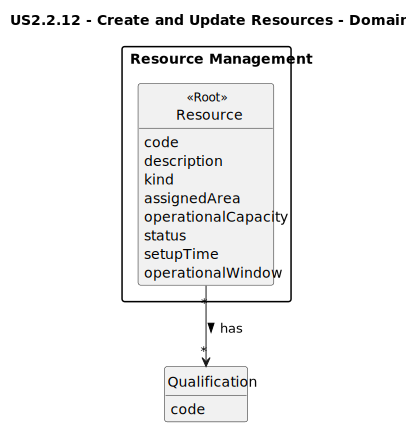

# US2.2.12 - Register and manage physical resources

## 2. Analysis

### 2.1. Relevant Domain Model Excerpt 

### 2.2. Key Concepts and Invariants
- Resource uniquely identified by ResourceCode (unique across the system).
- Kind drives capacity shape:
  - Crane: AverageContainersPerHour > 0
  - Truck: ContainersPerTrip > 0 and AverageSpeedKmh > 0
  - Other: Unit not empty and GenericValue > 0
- SetupTime.Minutes >= 0.
- OperationalWindow.StartTime < EndTime.
- Qualifications: a resource may require zero or more staff Qualifications.

### 2.3. Other Remarks
- AssignedArea is optional and may reference Dock/Yard codes when available.
