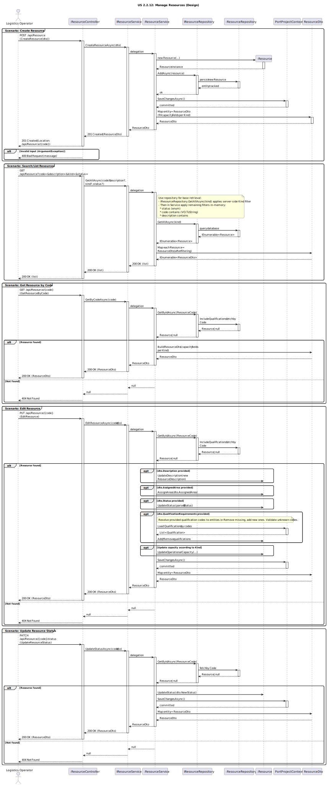

# US2.2.12 - Manage Resources (Create, Search, Get by Code, Edit, Update Status)

## 3. Design - User Story Realization

### 3.1. Rationale

| Interaction ID (Inferred SSD Step)                                            | Question: Which class is responsible for...                                             | Answer                         | Justification (with patterns)                                                                                                                                                                                                 |
|:------------------------------------------------------------------------------|:----------------------------------------------------------------------------------------|:-------------------------------|:-------------------------------------------------------------------------------------------------------------------------------------------------------------------------------------------------------------------------------|
| **Scenario: Create Resource**                                                 |                                                                                        |                                |                                                                                                                                                                                                                                |
| Step 1 (Officer requests to create a resource)                                | ... interacting with the actor to create a new resource?                               | `ResourceController`           | Controller / Pure Fabrication: Handles the HTTP POST and coordinates the creation flow between layers.                                                                                                                       |
|                                                                               | ... receiving input data as a transferable object?                                     | `CreateResourceDto`            | Information Expert (IE): Inbound DTO encapsulates the data needed to create a resource (Code, Description, Kind, Status, Setup/Window, capacity fields per Kind, AssignedArea, QualificationRequirements).                     |
| Step 2 (System processes creation)                                            | ... coordinating the creation logic?                                                   | `ResourceService`              | Application Service: Orchestrates the use case, applies business rules and delegates persistence.                                                                                                                             |
|                                                                               | ... defining the rules and structure of a resource?                                    | `Resource`                     | Domain Entity / IE: Encapsulates attributes and behaviors (code, description, kind, status, assigned area, operational capacity, setup time, operational window, qualifications) and enforces invariants.                      |
|                                                                               | ... validating and mapping DTO fields (enums/VOs/capacities)?                          | `ResourceService`              | Information Expert / PF: Parses Kind/Status, builds `ResourceOperationalCapacity` per Kind, creates `ResourceCode`, `ResourceDescription`, `ResourceSetupTime`, `ResourceOperationalWindow`; resolves qualification codes.     |
|                                                                               | ... persisting the new resource?                                                       | `ResourceRepository`           | Repository (DDD): Saves new `Resource` aggregate.                                                                                                                                                                              |
|                                                                               | ... abstracting persistence operations?                                                | `IResourceRepository`          | Interface Segregation / PF: Defines repository contracts (`AddAsync`, `GetByIdAsync`, `GetAllAsync`, ...), decoupling service from persistence details.                                                                     |
|                                                                               | ... committing the unit of work?                                                       | `PortProjectContext`           | Unit of Work: `SaveChangesAsync()` commits the transaction after repository operations.                                                                                                                                       |
|                                                                               | ... creating a new instance of the entity?                                             | `Resource`                     | Creator: Constructor enforces invariants and associates optional qualifications.                                                                                                                                              |
| Step 3 (System responds)                                                      | ... mapping the entity back to a DTO to return to the user?                            | `ResourceService`              | Pure Fabrication: Handles entity-to-DTO conversion (`ResourceDto`), including Kind-specific capacity fields (Crane/Truck/Other).                                                                                              |
|                                                                               | ... sending the confirmation of creation to the user?                                  | `ResourceController`           | Information Expert: Returns 201 Created with the created `ResourceDto` and Location header via `CreatedAtAction(nameof(GetResourceByCode))`.                                                                                  |
|                                                                               | ... handling invalid input and returning a client error?                               | `ResourceController`           | Error Mapping: Catches `ArgumentException` from service/domain and returns 400 Bad Request with message.                                                                                                                      |
| **Scenario: Search/List Resources**                                           |                                                                                        |                                |                                                                                                                                                                                                                                |
| Step 1 (Officer requests to search resources)                                 | ... handling the request from the actor?                                               | `ResourceController`           | Controller / Adapter: Adapts HTTP GET query to internal service call.                                                                                                                                                          |
| Step 2 (System retrieves and filters)                                         | ... retrieving resources with optional filters efficiently?                            | `ResourceRepository` / Service | Repository applies server-side enum filters (Kind). The service then applies remaining filters in-memory safely (Status, Code contains, Description contains) and maps to `ResourceDto`.                                       |
| Step 3 (System responds)                                                      | ... sending the resource list to the actor?                                            | `ResourceController`           | Information Expert: Sends 200 OK with `IEnumerable<ResourceDto>`.                                                                                                                                                              |
| **Scenario: Get Resource by Code**                                            |                                                                                        |                                |                                                                                                                                                                                                                                |
| Step 1 (Officer requests a specific resource)                                 | ... handling the request from the actor?                                               | `ResourceController`           | Controller / Adapter: Adapts HTTP GET to internal service call.                                                                                                                                                                |
| Step 2 (System locates and maps entity)                                       | ... locating the existing resource by code?                                            | `ResourceRepository`           | Repository: Retrieves the aggregate by `ResourceCode`, including qualifications when needed.                                                                                                                                  |
|                                                                               | ... preparing and returning the resource data?                                         | `ResourceService`              | Pure Fabrication: Converts the entity to `ResourceDto` and fills capacity fields per Kind; returns null if not found.                                                                                                         |
| Step 3 (System responds)                                                      | ... sending the resource to the actor?                                                 | `ResourceController`           | Information Expert: Sends 200 OK with `ResourceDto` if found; otherwise 404 Not Found.                                                                                                                                        |
| **Scenario: Edit Resource**                                                   |                                                                                        |                                |                                                                                                                                                                                                                                |
| Step 1 (Officer requests to edit a resource)                                  | ... handling the update request?                                                       | `ResourceController`           | Controller / Adapter: Adapts HTTP PUT to service call.                                                                                                                                                                         |
| Step 2 (System validates and updates entity)                                  | ... locating the existing resource?                                                    | `ResourceRepository`           | Repository: Retrieves aggregate by `ResourceCode` (including qualifications).                                                                                                                                                 |
|                                                                               | ... updating attributes conditionally based on DTO fields?                             | `ResourceService` / `Resource` | Application Service coordinates; Entity owns state and validates invariants in methods: `UpdateDescription`, `AssignArea`, `UpdateStatus`, `UpdateOperationalCapacity`, `Add/RemoveQualification`.                            |
|                                                                               | ... persisting the modified entity?                                                    | `PortProjectContext`           | Unit of Work: `SaveChangesAsync()` persists updates.                                                                                                                                                                           |
| Step 3 (System responds)                                                      | ... preparing and returning the updated resource data?                                 | `ResourceService`              | Pure Fabrication: Maps the updated entity to `ResourceDto`.                                                                                                                                                                    |
|                                                                               | ... sending confirmation of the update to the actor?                                   | `ResourceController`           | Returns 200 OK with `ResourceDto` or 404 Not Found if the code doesn’t exist.                                                                                                                                                  |
| **Scenario: Update Resource Status**                                          |                                                                                        |                                |                                                                                                                                                                                                                                |
| Step 1 (Officer requests to update status)                                    | ... handling the status update request?                                                | `ResourceController`           | Controller / Adapter: Adapts HTTP PATCH to service call.                                                                                                                                                                       |
| Step 2 (System validates and updates status)                                  | ... locating and updating status atomically?                                           | `ResourceRepository` / Entity  | Repository locates by code; Entity method `UpdateStatus(newStatus)` enforces allowed transitions/invariants.                                                                                                                  |
|                                                                               | ... persisting the status change?                                                      | `PortProjectContext`           | Unit of Work: `SaveChangesAsync()` commits the change.                                                                                                                                                                         |
| Step 3 (System responds)                                                      | ... returning the updated resource data?                                               | `ResourceService`              | Maps to `ResourceDto` and returns to controller.                                                                                                                                                                               |

Notes & Error Handling
- Domain invariants and validations:
  - `Code` is required and unique (value object `ResourceCode`).
  - `Kind` and `Status` must be valid enum values.
  - Capacity fields are Kind-specific and validated:
    - Crane: `AverageContainersPerHour` required, positive.
    - Truck: `ContainersPerTrip` and `AverageSpeedKmh` required, positive.
    - Other: `OtherUnit` (non-empty) and `OtherGenericValue` required.
  - `SetupTimeMinutes` non-negative; `OperationalWindowStart/End` define a valid window.
  - Qualification codes must exist; unknown codes cause a client error.
- Errors:
  - Create: invalid inputs yield `ArgumentException` → 400 Bad Request (caught in controller).
  - Get/Edit/Status: 404 Not Found if the resource code does not exist.

---

### Systematization

According to the rationale, the following conceptual classes were promoted to software classes in the system:

#### Domain Layer
- `Resource` – Aggregate root representing an operational resource with code, description, kind, status, assigned area, operational capacity, setup time, operational window, and qualification requirements.
- Value Objects:
  - `ResourceCode` – validated identifier (unique).
  - `ResourceDescription` – textual description.
  - `ResourceOperationalCapacity` – capacity abstraction with factories `ForCrane`, `ForTruck`, `ForOther`.
  - `ResourceSetupTime` – setup time in minutes.
  - `ResourceOperationalWindow` – start and end times (TimeOnly).
- Enums:
  - `ResourceKind` – `Crane`, `Truck`, `Other`.
  - `ResourceStatus` – e.g., `Active`, `Inactive`, etc.
- Domain behaviors:
  - `UpdateDescription`, `AssignArea`, `UpdateStatus`, `UpdateOperationalCapacity`, `AddQualification`, `RemoveQualification`.

#### Application Layer
- `IResourceService` – Defines operations for managing resources (create, search, get by code, edit, update status).
- `ResourceService` – Implements orchestration, mapping DTO↔domain, repository coordination, and commits with `PortProjectContext`.
- DTOs:
  - `CreateResourceDto` (input)
  - `ResourceDto` (output)
  - `EditResourceDto` (input for updates)
  - `UpdateResourceStatusDto` (input for status changes)

#### Infrastructure Layer
- `IResourceRepository` – Interface defining persistence operations for resources (e.g., `AddAsync`, `GetByIdAsync`, `GetAllAsync`).
- `ResourceRepository` – Implements the data access layer for resources (includes qualifications when appropriate).
- `PortProjectContext` – EF Core DbContext used to persist changes (`SaveChangesAsync`).

#### Presentation Layer
- `ResourceController` – Handles HTTP requests for resources (observed in `PortProject.Api/Controllers/ResourceController.cs`):
  - `POST /api/Resource` → Create resource (201 Created with `ResourceDto`, Location header points to `GetResourceByCode`).
  - `GET /api/Resource?code=&description=&kind=&status=` → Filtered search (200 OK with list of `ResourceDto`).
  - `GET /api/Resource/{code}` → Get by code (200 OK with `ResourceDto` or 404 Not Found).
  - `PUT /api/Resource/{code}` → Edit resource (200 OK with `ResourceDto` or 404 Not Found).
  - `PATCH /api/Resource/{code}/status` → Update status (200 OK with `ResourceDto` or 404 Not Found).

---

### Full Diagram

The following diagram shows the complete design realization for the Manage Resources user story (Create, Search, Get by Code, Edit, Update Status). It reflects a layered architecture with a repository between service and persistence and the mapping to/from DTOs.

