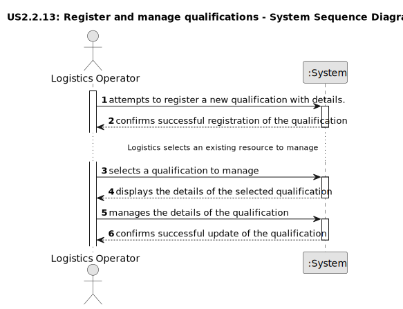

# US2.2.13 - Register and manage qualifications

## 1. Requirements Engineering

### 1.1. User Story Description

As a Logistics Operator, I want to register and manage qualifications (create, update), so that staff members and resources can be consistently associated with the correct skills and certifications required for port operations

### 1.2. Customer Specifications and Clarifications

**From the specifications document:**

>  The Logistics Operator is the user responsible for recording and managing qualifications.
>
>  Each qualification registered in the system must have, at a minimum:
    ◦ A unique code for unambiguous identification.
    ◦ A descriptive name that clarifies the competency.
>
> Para facilitar a gestão, o sistema deve permitir que as qualificações sejam pesquisadas e filtradas por código ou por nome

### 1.3. Acceptance Criteria

*   **AC1:**  Each qualification has a unique code and a descriptive name (e.g., "STS Crane Operator," 
"Truck Driver").
*   **AC2:**  Qualifications must be searchable and filterable by code or name.
*   **AC3:**  A qualification must exist before it can be assigned to staff members or resources.

### 1.4. Found out Dependencies

*   Nothing significant found.

### 1.5 Input and Output Data

**Input Data (Authentication):**

*   Typed data:
  *   Unique code
  *   Descriptive name

**Output Data (Authentication):**

*   Successful operation:
  *   Confirmation message
*   Failed Operation:
  *   Error message.

### 1.6. System Sequence Diagram (SSD)

The following SSD illustrates the generic flow of events for registering and updating storage areas:

