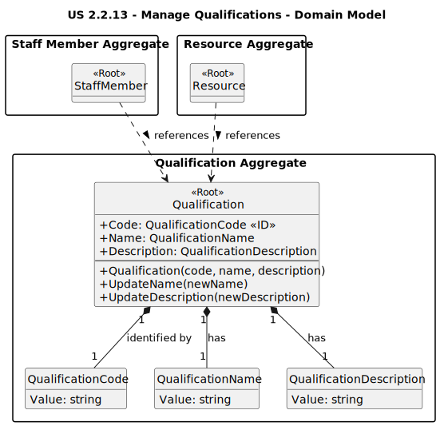

# US 2.2.13: Manage Qualifications - Analysis Domain Model

This diagram shows the `Qualification` aggregate, which is relatively simple as it primarily holds descriptive data used by other aggregates (`StaffMember`, `Resource`).

*(Diagram generated from [us2.2.13-domain-model.puml](puml/us2.2.13-domain-model.puml))*

## Key Domain Concepts

* **Qualification**: The **Aggregate Root**. It ensures the validity and consistency of its data. It is uniquely identified by its `Code`.
* **QualificationCode**: A **Value Object** representing the unique identifier. Its constructor enforces format rules (e.g., non-empty, max length). This guarantees uniqueness and validity within the domain (**AC1**).
* **QualificationName**: A **Value Object** ensuring the name follows defined rules (e.g., non-empty, max length).
* **QualificationDescription**: A **Value Object** holding the optional description, potentially enforcing length limits.
* **Immutability (Partial):** While the `Name` and `Description` can be updated via methods on the aggregate (`UpdateName`, `UpdateDescription`), the `Code` (the identifier) is immutable after creation.