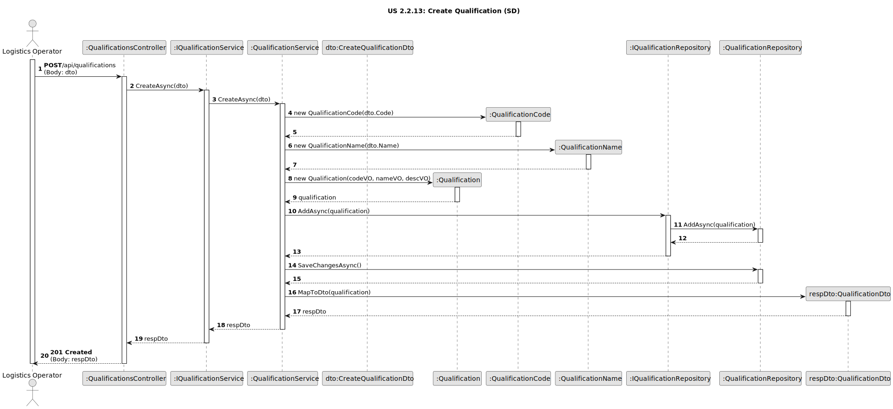
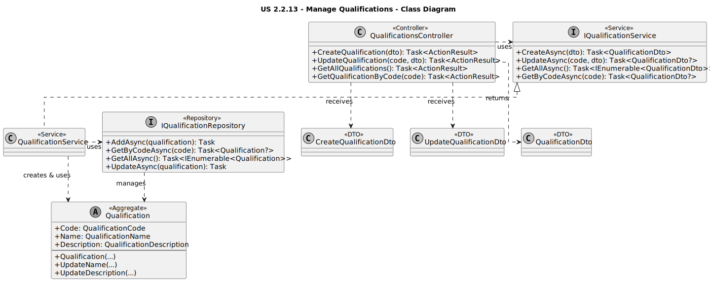

# US 2.2.13: Manage Qualifications - Design

## 3.1. Rationale

The design utilizes a standard layered architecture. The `Qualification` aggregate is simple, primarily acting as reference data for other aggregates.

| Interaction | Question: Which class is responsible for... | Answer | Justification (with patterns) |
| :--- | :--- | :--- | :--- |
| **Step 1 (Receive Request)** | ...handling the HTTP `POST`, `PUT`, `GET` requests? | `QualificationsController` | **Controller (GRASP):** Entry point for API requests related to qualifications. Translates HTTP actions into service calls. |
| **Step 2 (Orchestrate)** | ...coordinating the creation, update, or retrieval of qualifications? | `QualificationService` | **Service Layer / Pure Fabrication:** Orchestrates the use case. Uses the repository to fetch/save and manages the DTO mapping. |
| | ...finding/saving the `Qualification` aggregate? | `IQualificationRepository` | **Repository:** Abstracts data access for `Qualification` aggregates. |
| **Step 3 (Execute Logic)** | ...creating a `Qualification` and ensuring its initial state (code, name) is valid? | `Qualification` (Aggregate) | **Information Expert (GRASP):** The aggregate root's constructor ensures required fields are provided and delegates validation to its Value Objects (`QualificationCode`, `QualificationName`). |
| | ...validating and updating the `Name` or `Description`? | `Qualification` (Aggregate) | **Information Expert (GRASP):** The `UpdateName` and `UpdateDescription` methods encapsulate the logic for changing these attributes, using the corresponding Value Objects for validation. |
| **Step 4 (Persist State)** | ...saving the new or modified `Qualification` aggregate? | `IQualificationRepository` (via `DbContext`) | **Repository / Unit of Work:** The service calls `AddAsync` or `UpdateAsync` on the repository, which interacts with the `DbContext` to track and save changes via `SaveChangesAsync` (called in the service). |
| **Step 5 (Send Response)** | ...transforming the domain entity/entities into DTOs for the response? | `QualificationService` | **Service Layer / DTO:** The service maps the `Qualification` aggregate(s) to `QualificationDto` using its `MapToDto` helper method. |

## 3.2. Sequence Diagram (SD)

This diagram illustrates the **Create Qualification** scenario. The update and retrieval scenarios follow similar patterns.

*(Diagram generated from [us2.2.13-sequence-diagram.puml](puml/us2.2.13-sequence-diagram.puml))*

## 3.3. Class Diagram (CD)

This diagram shows the main classes and interfaces involved in implementing this use case.

*(Diagram generated from [us2.2.13-class-diagram.puml](puml/us2.2.13-class-diagram.puml))*