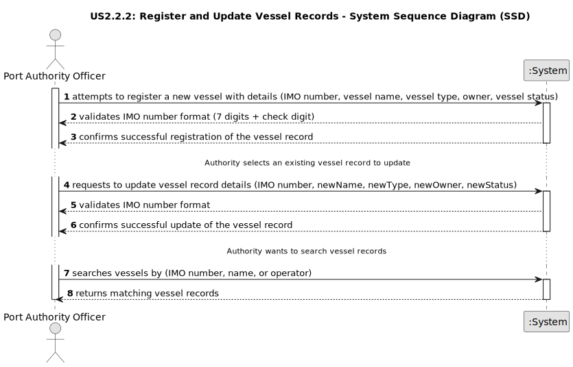

# US2.2.2 - Register and Update Vessel Records

## 1. Requirements Engineering

### 1.1. User Story Description

As a Port Authority Officer, I want to register and update vessel records, so that valid vessels can be referenced in visit notifications.

### 1.2. Customer Specifications and Clarifications

**From the specifications document:**

> Ports receive a wide variety of vessels, ranging from small feeder ships to large ocean-going container vessels. Each vessel is uniquely identified by an IMO (International Maritime Organization) number, which serves as its international registration and is linked to national or regional maritime authorities. The size, type, and cargo capacity of a vessel strongly influence its operational needs at the port, such as the length of dock required, the number of STS cranes that can be engaged, and the volume of containers to be handled. (Section 3.1.3 Vessels, Page 4)
>
> Each vessel record must include key attributes such as IMO number, vessel name, vessel type and operator/owner. (Acceptance Criteria for US2.2.2, Page 2)
>
> The system must validate that the IMO number follows the official format (seven digits with a check digit), otherwise reject it. (Acceptance Criteria for US2.2.2, Page 2)
>
> Vessel records must be searchable by IMO number, name, or operator. (Acceptance Criteria for US2.2.2, Page 2)

### 1.3. Acceptance Criteria

*   **AC1:** The system must allow the Port Authority Officer to register a new vessel record, including its IMO number, vessel name, vessel type, and operator/owner.
*   **AC2:** The system must validate that the entered IMO number adheres to the official format (seven digits followed by a check digit); otherwise, the registration must be rejected with an appropriate error message.
*   **AC3:** The system must allow the Port Authority Officer to update an existing vessel record's details, such as its name, type, or operator/owner.
*   **AC4:** When updating, the system must re-validate the IMO number format if it is changed.
*   **AC5:** Vessel records must be searchable by IMO number.
*   **AC6:** Vessel records must be searchable by vessel name.
*   **AC7:** Vessel records must be searchable by operator.
*   **AC8:** Registered vessels must be available for selection and referencing in "Vessel Visit Notifications."

### 1.4. Found out Dependencies

*   This user story depends on US2.2.1 "As a Port Authority Officer, I want to create and update vessel types," as vessel records require a predefined `vessel type` to be selected.
*   The system will need a data persistence layer to store and retrieve vessel records.
*   The user interface (UI) for the Port Authority Officer will need to include forms for registering and updating vessel records, as well as search functionalities.
*   The validation logic for the IMO number format needs to be implemented.

### 1.5 Input and Output Data

**Input Data (Register Vessel Record):**

*   `imoNumber` (string): International Maritime Organization number (7 digits + 1 check digit).
*   `vesselName` (string): Name of the vessel.
*   `vesselTypeId` (string/integer): Identifier of the predefined vessel type.
*   `operatorOwner` (string): Name of the vessel's operator or owner.
*   `vesselStatus` (string, optional): Current status of the vessel (e.g., "active", "inactive").

**Output Data (Register Vessel Record):**

*   Successful registration: Confirmation message and the newly registered vessel record's details.
*   Failed registration: Error message (e.g., "Invalid IMO number format," "Vessel with this IMO number already exists," "Vessel type not found," "Invalid input data").

**Input Data (Update Vessel Record):**

*   `imoNumber` (string): The unique IMO number of the vessel to be updated.
*   `newName` (string, optional): New name for the vessel.
*   `newVesselTypeId` (string/integer, optional): New identifier for the predefined vessel type.
*   `newOperatorOwner` (string, optional): New operator or owner name.
*   `newStatus` (string, optional): New status of the vessel.

**Output Data (Update Vessel Record):**

*   Successful update: Confirmation message and the updated vessel record's details.
*   Failed update: Error message (e.g., "Vessel not found," "Invalid IMO number format," "Vessel type not found," "Invalid update data").

**Input Data (Search Vessel Records):**

*   `searchQuery` (string): Text to search in IMO number, vessel name, or operator.

**Output Data (Search Vessel Records):**

*   `vesselRecords` (list of objects): A list of vessel records matching the search query, each with its `imoNumber`, `vesselName`, `vesselTypeId`, `operatorOwner`, and `vesselStatus`.
*   No matches: Empty list or appropriate message.

### 1.6. System Sequence Diagram (SSD)

The following SSD illustrates the generic flow for registering, updating, and searching vessel records.
