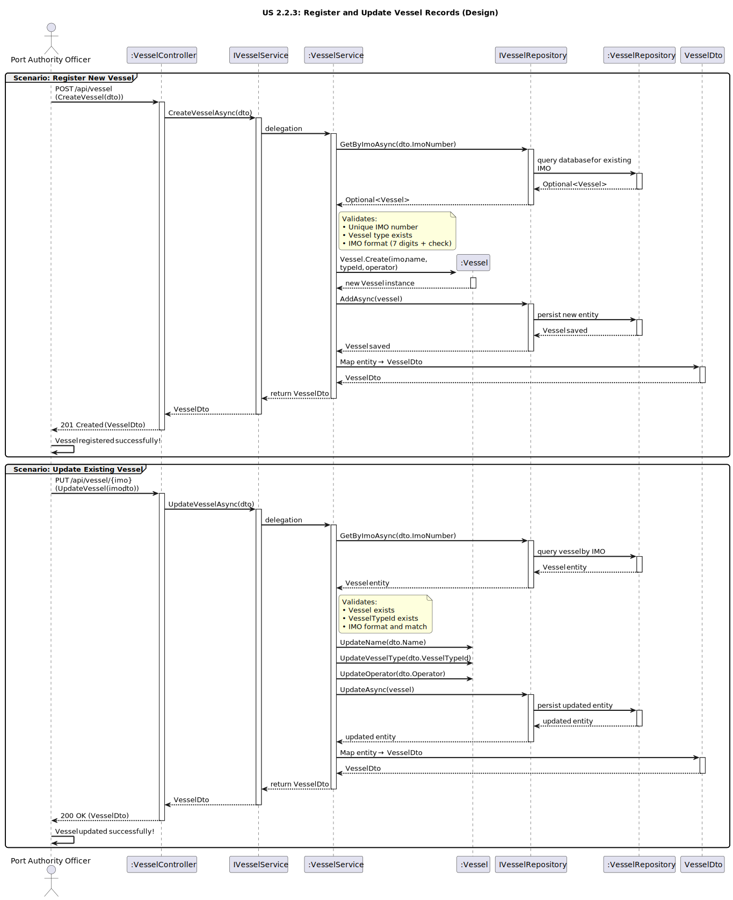

# US2.2.3 - Register and Update Vessels

## 3. Design - User Story Realization

### 3.1. Rationale

| Interaction ID (Inferred SSD Step)                                            | Question: Which class is responsible for...                                           | Answer                         | Justification (with patterns)                                                                                                                                              |
|:------------------------------------------------------------------------------|:--------------------------------------------------------------------------------------|:--------------------------------|:---------------------------------------------------------------------------------------------------------------------------------------------------------------------------|
| **Scenario: Register Vessel**                                                 |                                                                                        |                                 |                                                                                                                                                                            |
| Step 1 (Officer requests to register a new vessel)                            | ... interacting with the actor to register a vessel?                                  | `VesselController`              | **Controller / Pure Fabrication:** Handles the HTTP request (`POST /api/vessel`) and delegates creation to the service layer.                                              |
|                                                                               | ... receiving input data and converting it to a transferable object?                  | `VesselCreateDto`               | **Information Expert (IE):** Encapsulates client input data to be safely passed to the service layer.                                                                     |
| Step 2 (System processes registration)                                        | ... coordinating the registration logic?                                              | `VesselService`                 | **Application Service / Controller:** Orchestrates the creation process, validating IMO number format, vessel type existence, and business rules.                           |
|                                                                               | ... persisting the new vessel record?                                                 | `VesselRepository`              | **Repository (DDD Pattern):** Responsible for saving new vessel entities to persistence.                                                                                   |
|                                                                               | ... abstracting persistence operations?                                               | `IVesselRepository`             | **Interface Segregation / Pure Fabrication:** Defines repository contracts for decoupling service and persistence.                                                         |
|                                                                               | ... creating a new instance of the entity?                                             | `VesselService` / `Vessel`      | **Creator Pattern:** Uses factory or constructor to enforce invariants and proper entity initialization.                                                                 |
| Step 3 (System responds)                                                      | ... mapping the entity back to a DTO to return to the user?                            | `VesselService` / Mapper        | **Pure Fabrication:** Handles entity-to-DTO conversion, isolating transformation logic.                                                                                     |
|                                                                               | ... sending the confirmation of creation to the user?                                  | `VesselController`              | **Information Expert (IE):** Returns HTTP 201 Created with the `VesselDto`.                                                                                                 |
| **Scenario: Update Vessel**                                                   |                                                                                        |                                 |                                                                                                                                                                            |
| Step 1 (Officer requests to update a vessel)                                  | ... handling the update request from the actor?                                        | `VesselController`              | **Controller / Adapter:** Adapts external HTTP requests to internal service calls.                                                                                        |
| Step 2 (System validates and updates entity)                                  | ... locating the existing vessel record?                                              | `VesselRepository`              | **Information Expert (IE):** Knows how to find existing vessels by IMO number.                                                                                             |
|                                                                               | ... validating vessel type existence and business rules?                               | `VesselService`                 | **Information Expert (IE):** Checks business rules, type existence, and IMO uniqueness before updating.                                                                   |
|                                                                               | ... performing the actual update of vessel attributes (name, type, operator)?         | `VesselService` / `Vessel`      | **Information Expert (IE):** Owns its own data and ensures entity consistency when updated.                                                                               |
|                                                                               | ... persisting the modified entity?                                                    | `VesselRepository`              | **Repository:** Saves updated vessel records to persistence.                                                                                                               |
| Step 3 (System responds)                                                      | ... preparing and returning the updated vessel data?                                   | `VesselService` / Mapper        | **Pure Fabrication:** Converts the updated entity into a DTO for API response.                                                                                              |
|                                                                               | ... sending confirmation of the update to the actor?                                   | `VesselController`              | **Information Expert (IE):** Sends HTTP 200 OK with the updated `VesselDto`.                                                                                                |

---

### Systematization

According to the rationale, the following conceptual classes were promoted to software classes in the system:

#### **Domain Layer**
- `Vessel` – Entity representing a vessel and its attributes (IMO number, name, type, operator).

#### **Application Layer**
- `IVesselService` – Defines service operations for managing vessel records.
- `VesselService` – Implements business logic, validates IMO format, coordinates domain and persistence.

#### **Infrastructure Layer**
- `IVesselRepository` – Interface defining persistence operations for vessel records.
- `VesselRepository` – Implements the data access layer for vessels.

#### **Presentation Layer**
- `VesselController` – Handles HTTP requests (Create, Update, Search, Delete) and sends appropriate responses.
- `VesselDto` / `VesselCreateDto` – Data Transfer Objects for exchanging data between client and API.

---

### Full Diagram

The following diagram shows the complete design realization for the *Register and Update Vessel Records* user story (covering **Create** and **Update** scenarios).

