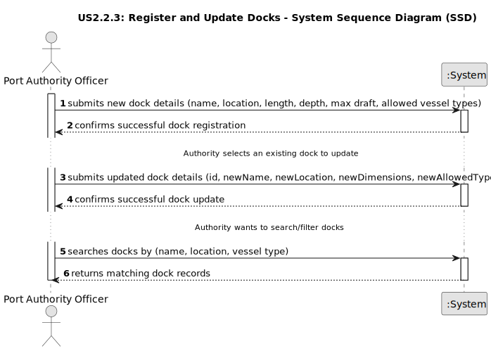

# US 2.2.3 - Register and Update Docks

## 1. Requirements Engineering

### 1.1. User Story Description

As a Port Authority Officer, I want to register and update docks, so that the system accurately reflects the docking capacity of the port.

### 1.2. Customer Specifications and Clarifications 

**From the specifications document:**
> The main components include docks (or quays) where vessels berth for loading and unloading operations, container yards for temporary storage of containers, and warehouses for cargo requiring additional handling or inspection.	
> The Port Authority is responsible for managing these facilities, ensuring that docks are allocated appropriately, yard capacity is monitored, and warehouses are operated according to port regulations and safety standards.
> Each dock has its own number of STS cranes — for instance, one dock might have a single crane, another might have two, and a larger dock could be equipped with five or more. When a vessel is assigned to a dock, the maximum number of STS cranes available for its operations is defined by that dock’s infrastructure.
> Once a Vessel Visit is approved, the Port Authority assigns a dock to the vessel. As previously stated, this process can be supported by an intelligent algorithm that considers pending visits, vessel type, expected cargo volume, dock capacity, and other constraints.

**From the client clarifications:**

> **Question:** Should each dock include the vessel types that are allowed to berth there?
>
> **Answer:** Yes, it is mandatory that registered docks specify the vessel types allowed (e.g., Feeder, Panamax, ULCV).

> **Question:** Can docks be temporarily deactivated (e.g., for maintenance)?
>
> **Answer:** Yes, the system must support different availability states (active/inactive) to reflect operational restrictions.

### 1.3. Acceptance Criteria

* **AC1:** A dock record must include a unique identifier, name/number, location within the port, and physical characteristics (e.g., length, depth, max draft).
* **AC2:** The officer must specify the vessel types allowed to berth there.
* **AC3:** Docks must be searchable and filterable by name, vessel type, and location.

### 1.4. Found out Dependencies
* This user story depends on US2.2.1 (Vessel Types), since docks reference the types of vessels allowed to berth.
* It is a prerequisite for US2.2.7 (Review Vessel Visit Notifications), as berth assignment depends on available docks.
* The system requires a data persistence layer to store and manage dock information.
* The user interface must include forms for dock creation and updating, and search/filter functionalities.

### 1.5 Input and Output Data

**Input Data (Create Dock):**
* `name` (string): Unique name or number of the dock.
* `location` (string): Physical location within the port.
* `length` (float): Total dock length (in meters).
* `depth` (float): Water depth (in meters).
* `maxDraft` (float): Maximum vessel draft allowed (in meters).
* `allowedVesselTypes` (list): List of vessel type IDs permitted to berth at this dock.

**Output Data (Create Dock):**
* Successful creation: Confirmation message and newly created dock details.
* Failed creation: Error message (e.g., “Dock with this name already exists”, “Invalid vessel type reference”).

**Input Data (Update Dock):**
* `id` (integer/string): Unique dock identifier.
* `newName` (string, optional): Updated name.
* `newLocation` (string, optional): Updated location.
* `newLength` (float, optional): Updated dock length.
* `newDepth` (float, optional): Updated dock depth.
* `newMaxDraft` (float, optional): Updated maximum draft.
* `newAllowedVesselTypes` (list, optional): Updated list of allowed vessel types.

**Output Data (Update Dock):**
* Successful update: Confirmation message and updated dock details.
* Failed update: Error message (e.g., “Dock not found”, “Invalid update data”).

**Input Data (Search/Filter Docks):**
* `keyword` (string, optional): Text to search by name or location.
* `filterCriteria` (string, optional): Criteria such as vessel type or location.

**Output Data (Search/Filter Docks):**
* `docks` (list of objects): Matching docks, each with id, name, location, length, depth, maxDraft, and allowedVesselTypes.
* No matches: Empty list or message “No docks found.”

### 1.6. System Sequence Diagram (SSD)
The following SSD illustrates the generic flow for creating, updating, and searching/filtering docks.

