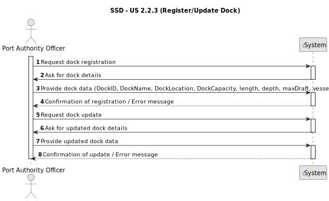

# US - 2.2.3

## 1. Requirements Engineering

### 1.1. User Story Description

As a Port Authority Officer, I want to register and update docks, so that the system accurately reflects the docking capacity of the port.

### 1.2. Customer Specifications and Clarifications 

**From the specifications document:**
> The main components include docks (or quays) where vessels berth for loading and unloading operations, container yards for temporary storage of containers, and warehouses for cargo requiring additional handling or inspection.	
> The Port Authority is responsible for managing these facilities, ensuring that docks are allocated appropriately, yard capacity is monitored, and warehouses are operated according to port regulations and safety standards.
> Each dock has its own number of STS cranes — for instance, one dock might have a single crane, another might have two, and a larger dock could be equipped with five or more. When a vessel is assigned to a dock, the maximum number of STS cranes available for its operations is defined by that dock’s infrastructure.
> Once a Vessel Visit is approved, the Port Authority assigns a dock to the vessel. As previously stated, this process can be supported by an intelligent algorithm that considers pending visits, vessel type, expected cargo volume, dock capacity, and other constraints.

**From the client clarifications:**

> **Question:** Should each dock include the vessel types that are allowed to berth there?
>
> **Answer:** Yes, it is mandatory that registered docks specify the vessel types allowed (e.g., Feeder, Panamax, ULCV).

> **Question:** Can docks be temporarily deactivated (e.g., for maintenance)?
>
> **Answer:** Yes, the system must support different availability states (active/inactive) to reflect operational restrictions.

### 1.3. Acceptance Criteria

* **AC1:** A dock record must include a unique identifier, name/number, location within the port, and physical characteristics (e.g., length, depth, max draft).
* **AC2:** The officer must specify the vessel types allowed to berth there.
* **AC3:** Docks must be searchable and filterable by name, vessel type, and location.

### 1.4. Found out Dependencies

* 

### 1.5 Input and Output Data

**Input Data:**
Officer-provided information:
  * Dock unique identifier (text/code)
  * Dock name/number (string)
  * Location within the port (string/enum)
  * Physical characteristics: length (m), depth (m), max draft (m)
  * Allowed vessel types (list of references to Vessel Types)
  * Dock status (active/inactive)
 
**Output Data:**
  * Operation success confirmation (dock created/updated).
  * Error messages in case of failure (e.g., duplicate identifier, invalid data, dock linked to active visits).
  * Dock information available for queries and listings.

### 1.6. System Sequence Diagram (SSD)

### 1.7 Other Relevant Remarks
* Docks can be temporarily deactivated for maintenance, without deleting their historical data.
* Updates must ensure consistency with scheduled or ongoing vessel visits.
* All operations must be logged, including officer ID, timestamp, and performed action.  