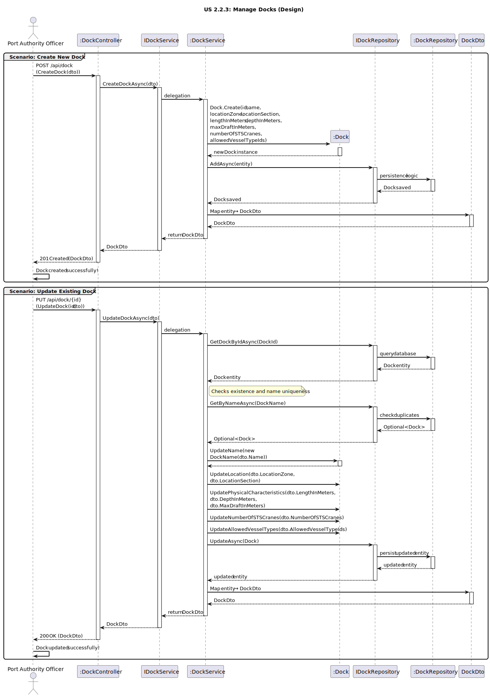

# US2.2.3 - Create and Update Docks

## 3. Design - User Story Realization

### 3.1. Rationale

| Interaction ID (Inferred SSD Step)           | Question: Which class is responsible for...                            | Answer                   | Justification (with patterns)                                                                                                                   |
|:---------------------------------------------|:-----------------------------------------------------------------------|:-------------------------|:------------------------------------------------------------------------------------------------------------------------------------------------|
| **Scenario: Create Dock**                    |                                                                        |                          |                                                                                                                                                 |
| Step 1 (Officer requests to create a dock)   | ... interacting with the actor to create a new dock?                   | `DockController`         | **Controller / Pure Fabrication:** Handles the HTTP request and coordinates the creation flow between layers.                                   |
|                                              | ... receiving input data and converting it to a transferable object?   | `DockDto`                | **Information Expert (IE):** Encapsulates transferable data between presentation and application layers.                                        |
| Step 2 (System processes creation)           | ... coordinating the creation logic?                                   | `DockService`            | **Controller / Application Service:** Orchestrates the use case, applies business rules, and delegates persistence.                             |
|                                              | ... defining the rules and structure of a dock?                        | `Dock`                   | **Domain Entity / Information Expert (IE):** Encapsulates attributes and behaviors ((name, location, dimensions, allowed vessel types).         |
|                                              | ... persisting the new dock?                                           | `DockRepository`         | **Repository (DDD Pattern):** Responsible for saving and retrieving domain aggregates.                                                          |
|                                              | ... abstracting persistence operations?                                | `IDockRepository`        | **Interface Segregation / Pure Fabrication:** Defines repository contracts, enabling decoupling between service and persistence implementation. |
|                                              | ... creating a new instance of the entity?                             | `Dock`                   | **Creator Pattern:** The entity creates itself through a static factory (`Dock.Create()`) ensuring validity and invariants.                     |
| Step 3 (System responds)                     | ... mapping the entity back to a DTO to return to the user?            | `DockService` / `Mapper` | **Pure Fabrication:** Handles entity-to-DTO conversion, isolating transformation logic.                                                         |
|                                              | ... sending the confirmation of creation to the user?                  | `DockController`         | **Information Expert (IE):** Returns the HTTP response (201 Created) with the created `DockDto`.                                                |
| **Scenario: Update Dock**                    |                                                                        |                          |                                                                                                                                                 |
| Step 1 (Officer requests to update a dock)     | ... handling the update request from the actor?                        | `DockController`         | **Controller / Adapter:** Adapts external HTTP requests to internal service calls.                                                              |
| Step 2 (System validates and updates entity) | ... locating the existing dock?                                        | `DockRepository`         | **Information Expert (IE):** Knows how to find existing records by ID.                                                                          |
|                                              | ... ensuring no duplicate dock names exist?                            | `DockService`            | **Information Expert (IE):** Applies business rules for name uniqueness.                                                                        |
|                                              | ... performing the actual update of attributes (name, location, etc.)? | `Dock`                   | **Information Expert (IE):** Owns its own data and is responsible for maintaining consistency when updated.                                     |
|                                              | ... persisting the modified entity?                                    | `DockRepository`         | **Repository:** Responsible for saving updated domain objects.                                                                                  |
| Step 3 (System responds)                     | ... preparing and returning the updated dock data?                     | `DockService` / `Mapper` | **Pure Fabrication:** Converts the updated entity into a DTO for API response.                                                                  |
|                                              | ... sending confirmation of the update to the actor?                   | `DockController`         | **Information Expert (IE):** Sends a 200 OK response with updated dock details.                                                                 |

---

### Systematization

According to the rationale, the following conceptual classes were promoted to software classes in the system:

#### **Domain Layer**
- `Dock` – Entity representing a dock and its operational constraints (ID, name, location, dimensions, and allowed vessel types).

#### **Application Layer**
- `IDockService` – Defines service operations for managing docks.
- `DockService` – Implements business logic, coordinates domain and persistence, and performs validation.

#### **Infrastructure Layer**
- `IDockRepository` – Interface defining persistence operations for docks.
- `DockRepository` – Implements the data access layer for docks.

#### **Presentation Layer**
- `DockController` – Handles HTTP requests (Create, Update, Search, Delete) and sends appropriate responses.
- `DockDto` – Data Transfer Object for exchanging data between client and API.

---

### Full Diagram

The following diagram shows the complete design realization for the *Manage Vessel Types* user story (covering **Create** and **Update** scenarios).

