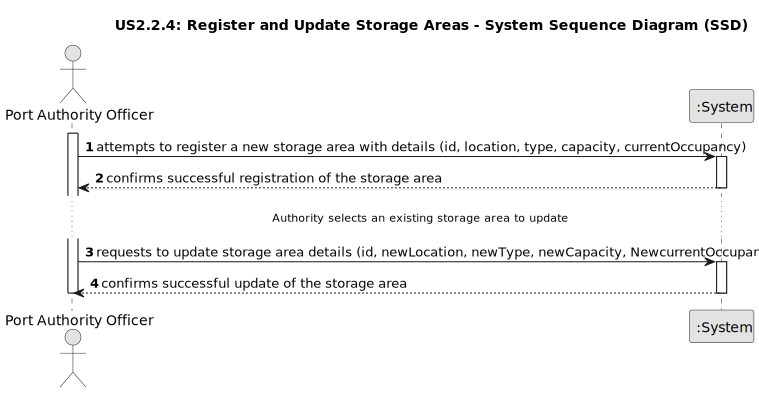

# US2.2.4 - Register and Update Storage Areas

## 1. Requirements Engineering

### 1.1. User Story Description

As a Port Authority Officer, I want to register and update storage areas, so that (un)loading and storage operations can be assigned to the correct locations.

### 1.2. Customer Specifications and Clarifications

**From the specifications document:**

> Each storage area must have a unique identifier, its type (e.g., container yard or warehouse), and its location within the port.
>
> The Port Authority is responsible for managing these facilities.
>
> Storage areas must specify their maximum capacity, measured in TEUs (Twenty-foot Equivalent Units), and their current occupancy.

### 1.3. Acceptance Criteria

*   **AC1:**  Each storage area must have a unique identifier, type (e.g., yard, warehouse), and location 
within the port.
*   **AC2:**  Storage areas must specify maximum capacity (in TEUs) and current occupancy.
*   **AC3:**  By default, a storage area serves the entire port (i.e., all docks). However, some storage areas 
(namely yards) may be constrained to serve only a few docks, usually the closest ones.
*   **AC4:**  Complementary information, such as the distance between docks and storage areas, must be 
manually recorded to support future logistics planning and optimization.
*   **AC5:**  Updates to storage areas must not allow the current occupancy to exceed maximum capacity.

### 1.4. Found out Dependencies

*   User Story 2.2.3:  It is impossible to fully implement the storage area functionality without first implementing dock management. One of the acceptance criteria for user story 2.2.4 states that, although a storage area can serve the entire port, it is possible to restrict it to serve only a limited number of docks, usually the closest ones.

### 1.5 Input and Output Data

**Input Data (Authentication):**

*   Typed data:
  *   ID
  *   Type
  *   Location
  *   Maximum capacity
  *   Current occupancy
  *   Dock Association (optional)

**Output Data (Authentication):**

*   Successful operation:
  *   Confirmation message
*   Failed Operation:
  *   Error message.

### 1.6. System Sequence Diagram (SSD)

The following SSD illustrates the generic flow of events for registering and updating storage areas:

