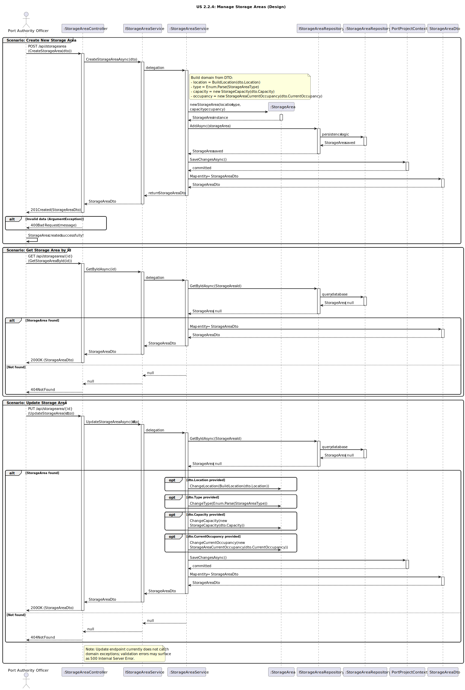

# US2.2.4 - Create and Update Storage Areas

## 3. Design - User Story Realization

### 3.1. Rationale

| Interaction ID (Inferred SSD Step)                                            | Question: Which class is responsible for...                                           | Answer                          | Justification (with patterns)                                                                                                                                                 |
|:------------------------------------------------------------------------------|:--------------------------------------------------------------------------------------|:---------------------------------|:--------------------------------------------------------------------------------------------------------------------------------------------------------------------------------|
| **Scenario: Create Storage Area**                                             |                                                                                      |                                  |                                                                                                                                                                                |
| Step 1 (Officer requests to create a storage area)                            | ... interacting with the actor to create a new storage area?                         | `StorageAreaController`          | Controller / Pure Fabrication: Handles the HTTP request and coordinates the creation flow between layers.                                                                      |
|                                                                               | ... receiving input data as a transferable object?                                   | `CreateStorageAreaDto`           | Information Expert (IE): Inbound DTO encapsulating the data required to create a storage area (Type, Location, Capacity, CurrentOccupancy).                                    |
| Step 2 (System processes creation)                                            | ... coordinating the creation logic?                                                 | `StorageAreaService`             | Application Service: Orchestrates the use case, applies business rules, and delegates persistence.                                                                             |
|                                                                               | ... defining the rules and structure of a storage area?                              | `StorageArea`                    | Domain Entity / IE: Encapsulates attributes and behaviors (Location, Type, Capacity, CurrentOccupancy) and enforces invariants.                                                |
|                                                                               | ... building the domain from the DTO (parse enum, parse location, create VOs)?       | `StorageAreaService`             | Information Expert / Pure Fabrication: Parses `dto.Type` to `StorageAreaType`, builds `StorageAreaLocation`, `StorageCapacity`, and `StorageAreaCurrentOccupancy`.             |
|                                                                               | ... persisting the new storage area?                                                 | `StorageAreaRepository`          | Repository (DDD): Saves and retrieves `StorageArea` aggregates.                                                                                                                |
|                                                                               | ... abstracting persistence operations?                                              | `IStorageAreaRepository`         | Interface Segregation / Pure Fabrication: Defines repository contracts, enabling decoupling between service and persistence implementation.                                     |
|                                                                               | ... committing the unit of work?                                                     | `PortProjectContext`             | Unit of Work: `SaveChangesAsync()` commits the transaction after repository operations.                                                                                        |
|                                                                               | ... creating a new instance of the entity?                                           | `StorageArea`                    | Creator: Constructor enforces invariants (e.g., non-null VOs, occupancy ≤ capacity).                                                                                           |
| Step 3 (System responds)                                                      | ... mapping the entity back to a DTO to return to the user?                          | `StorageAreaService`             | Pure Fabrication: Handles entity-to-DTO conversion (`StorageAreaDto`), isolating transformation logic.                                                                          |
|                                                                               | ... sending the confirmation of creation to the user?                                | `StorageAreaController`          | Information Expert: Returns HTTP 201 Created with the created `StorageAreaDto` and Location header via `CreatedAtAction`.                                                       |
|                                                                               | ... handling invalid input and returning a client error?                             | `StorageAreaController`          | Error Mapping: Catches `ArgumentException` from service/domain and returns 400 Bad Request with message.                                                                       |
| **Scenario: Get Storage Area by Id**                                          |                                                                                      |                                  |                                                                                                                                                                                |
| Step 1 (Officer requests to retrieve a storage area)                          | ... handling the request from the actor?                                             | `StorageAreaController`          | Controller / Adapter: Adapts HTTP GET to internal service call.                                                                                                               |
| Step 2 (System locates and maps entity)                                       | ... locating the existing storage area by id?                                        | `StorageAreaRepository`          | Information Expert / Repository: Knows how to find existing records by `StorageAreaId`.                                                                                       |
|                                                                               | ... preparing and returning the storage area data?                                   | `StorageAreaService`             | Pure Fabrication: Converts the entity into `StorageAreaDto` if found; otherwise returns `null`.                                                                                |
| Step 3 (System responds)                                                      | ... sending the storage area to the actor?                                           | `StorageAreaController`          | Information Expert: Sends 200 OK with `StorageAreaDto` if found; otherwise 404 Not Found.                                                                                      |
| **Scenario: Update Storage Area**                                             |                                                                                      |                                  |                                                                                                                                                                                |
| Step 1 (Officer requests to update a storage area)                            | ... handling the update request?                                                     | `StorageAreaController`          | Controller / Adapter: Adapts external HTTP PUT to internal service call.                                                                                                       |
| Step 2 (System validates and updates entity)                                  | ... locating the existing storage area?                                              | `StorageAreaRepository`          | Repository: Retrieves the aggregate by `StorageAreaId`.                                                                                                                        |
|                                                                               | ... updating attributes conditionally based on DTO fields?                           | `StorageAreaService` / `StorageArea` | Application Service coordinates; Entity owns its state and validates invariants in `Change*` methods (e.g., occupancy ≤ capacity).                                             |
|                                                                               | ... persisting the modified entity?                                                  | `PortProjectContext`             | Unit of Work: `SaveChangesAsync()` persists the updates.                                                                                                                       |
| Step 3 (System responds)                                                      | ... preparing and returning the updated storage area data?                           | `StorageAreaService`             | Pure Fabrication: Maps the updated entity to `StorageAreaDto`.                                                                                                                 |
|                                                                               | ... sending confirmation of the update to the actor?                                 | `StorageAreaController`          | Returns 200 OK with `StorageAreaDto` or 404 Not Found if the id doesn’t exist.                                                                                           |

Notes & Error Handling
- Domain invariants: `capacity > 0`, `currentOccupancy ≥ 0`, `currentOccupancy ≤ capacity`.
- Invalid DTO data (e.g., bad coordinates, negative capacity) triggers `ArgumentException` → 400 Bad Request (handled by controller in Create).
- Update endpoint currently doesn’t catch domain exceptions; validation errors may surface as 500. Consider catching `ArgumentException`/`ArgumentOutOfRangeException` and returning 400.

---

### Systematization

According to the rationale, the following conceptual classes were promoted to software classes in the system:

#### Domain Layer
- `StorageArea` – Aggregate root representing a storage area with Location, Type, Capacity, and CurrentOccupancy.
- `StorageAreaLocation` – Value object for coordinates (X, Y) with validation.
- `StorageCapacity` – Value object for capacity (positive integer).
- `StorageAreaCurrentOccupancy` – Value object for current occupancy (non-negative, must not exceed capacity at construction/update time).
- `StorageAreaType` – Enum (`Yard`, `Warehouse`).

#### Application Layer
- `IStorageAreaService` – Defines service operations for managing storage areas.
- `StorageAreaService` – Implements creation, retrieval, and update logic; orchestrates domain and persistence; commits with `PortProjectContext`.
- DTOs: `CreateStorageAreaDto` (input), `StorageAreaDto` (output), `UpdateStorageAreaDto` (input for updates).

#### Infrastructure Layer
- `IStorageAreaRepository` – Interface defining persistence operations for storage areas (`AddAsync`, `GetByIdAsync`, `GetAllAsync`).
- `StorageAreaRepository` – Implements the data access layer for storage areas.
- `PortProjectContext` – EF Core DbContext used to persist changes (`SaveChangesAsync`).

#### Presentation Layer
- `StorageAreaController` – Handles HTTP requests for storage areas:
  - `POST /api/StorageArea` → Create storage area (201 Created with `StorageAreaDto`).
  - `GET /api/StorageArea/{id}` → Get by id (200 OK with `StorageAreaDto` or 404 Not Found).
  - `PUT /api/StorageArea/{id}` → Update storage area (200 OK with `StorageAreaDto` or 404 Not Found).

---

### Full Diagram

The following diagram shows the complete design realization for the Manage Storage Areas user story (covering Create, Get by Id, and Update scenarios).

