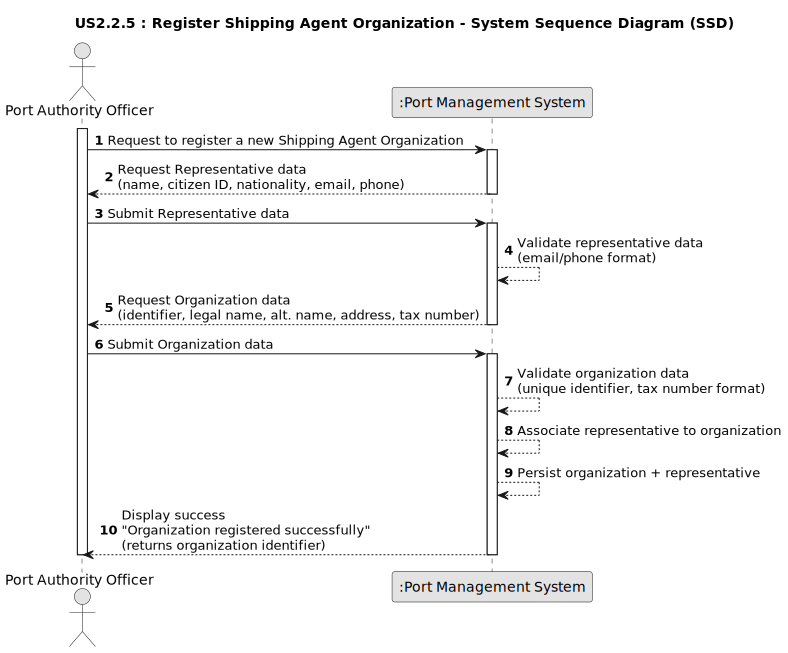

# US2.2.5 - Register Shipping Agent Organization

## 1. Requirements Engineering

### 1.1. User Story Description

As a Port Authority Officer, I want to register new Shipping Agent Organizations, so that they can operate within the port’s digital system.

### 1.2. Specifications and Clarifications

**From the specifications document:**

> Each organization must have at least an identifier, legal and alternative names, an address, and its tax number.
>
> Each organization must include at least one representative at the time of registration.
>
> Representatives must be registered with name, citizen ID, nationality, email, and phone number.
>
> Email and phone number are used for system notifications, including approval decisions and the authentication process.

### 1.3. Acceptance Criteria

*   **AC1:** The Port Authority Officer must provide all required data for the new organization (identifier, legal name, alternative name, address, tax number).
*   **AC2:** The Port Authority Officer must provide all required data for at least one representative (name, citizen ID, nationality, email, phone).
*   **AC3:** The system must ensure that the organization identifier and tax number are unique.
*   **AC4:** Upon successful registration, the organization and its initial representative must be stored and associated in the system.
*   **AC5:** The system must confirm the success or failure of the operation to the Port Authority Officer.
*   **AC6:** If registration fails (e.g., duplicate tax number, invalid data), the Port Authority Officer must receive an error message, and no partial data should be persisted.

### 1.4. Found out Dependencies

*   Depends on the Shipping Agent Organization Management module for storing organization data.
*   Depends on the Shipping Agent Representative Management module for storing representative data.
*   Depends on User Management / Notification components for handling authentication credentials and sending notifications (email, SMS).
*   Requires the Port Authority Officer to be authenticated and authorized (linked with Authentication & Authorization US).

### 1.5 Input and Output Data

**Input Data (Interactive Registration by Port Authority Officer):**

*   Organization Data:
    *   Identifier (unique)
    *   Legal Name
    *   Alternative Name(s)
    *   Address (Street, City, Postal Code, Country)
    *   Tax Number
*   Initial Representative Data:
    *   Full Name
    *   Citizen ID
    *   Nationality
    *   Email
    *   Phone Number

**Output Data (Interactive Registration):**

*   Confirmation message indicating success or failure:
    *   Example (Success): `"Shipping Agent Organization 'Atlantic Shippers' registered successfully"`
    *   Example (Failure): `"Error: Tax Number already exists in the system"`
*   The creation of a new Shipping Agent Organization record.
*   The creation of a new Representative record linked to the organization.
*   Association of the representative with authentication credentials (for system access and notifications).

### 1.6. System Sequence Diagram (SSD)

The following SSD illustrates the interactive flow for a CRM Collaborator registering a new customer and their initial representative.

