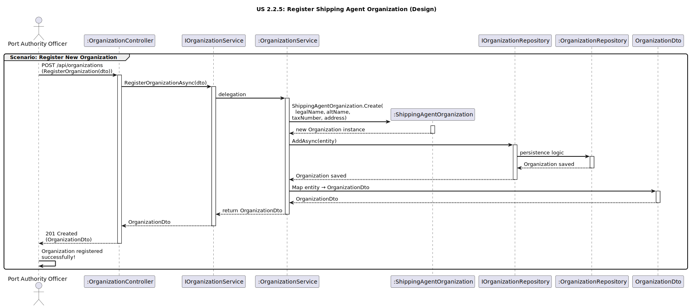

# US2.2.5 - Register Shipping Agent Organization

## 3. Design - User Story Realization

### 3.1. Rationale

| Interaction ID (Inferred SSD Step)                                     | Question: Which class is responsible for…                                              | Answer                               | Justification (with patterns)                                                                                                                                             |
|:------------------------------------------------------------------------|:---------------------------------------------------------------------------------------|:--------------------------------------|:--------------------------------------------------------------------------------------------------------------------------------------------------------------------------|
| **Scenario: Register Organization**                                     |                                                                                        |                                       |                                                                                                                                                                           |
| Step 1 (Officer requests to register an organization)                   | …interacting with the actor to create a new organization?                              | `OrganizationController`              | **Controller / Pure Fabrication:** Handles the HTTP request and coordinates the flow.                                                                                     |
|                                                                          | …receiving input data and converting it to a transferable object?                      | `OrganizationDto`                     | **Information Expert (IE):** Encapsulates transferable data between presentation and application layers.                                                                  |
| Step 2 (System processes creation)                                      | …coordinating the registration logic?                                                  | `OrganizationService`                 | **Application Service:** Orchestrates the use case and applies business rules.                                                                                            |
|                                                                          | …defining rules/structure of an organization (legalName, taxNumber, address)?          | `ShippingAgentOrganization`           | **Domain Entity / Aggregate Root / IE:** Holds attributes and invariants of the organization.                                                                             |
|                                                                          | …creating the new aggregate instance?                                                  | `ShippingAgentOrganization`           | **Creator / Factory Method:** Static factory ensures invariants (e.g., `Create(…)`).                                                                                      |
|                                                                          | …persisting the new organization?                                                      | `OrganizationRepository`              | **Repository (DDD):** Responsible for saving aggregates.                                                                                                                  |
|                                                                          | …abstracting persistence operations?                                                   | `IOrganizationRepository`             | **Interface Segregation / Pure Fabrication:** Contract for persistence decouples service from infra.                                                                      |
| Step 3 (System responds)                                                | …mapping the aggregate back to a DTO to return to the user?                            | `OrganizationService` / `Mapper`      | **Pure Fabrication:** Centralizes entity↔DTO mapping logic.                                                                                                               |
|                                                                          | …sending the confirmation of creation to the user?                                     | `OrganizationController`              | **Controller:** Returns HTTP **201 Created** with the created `OrganizationDto`.                                                                                          |

---

### Systematization

According to the rationale, the following conceptual classes were promoted to software classes in the system:

#### **Domain Layer**
- `ShippingAgentOrganization` – Aggregate root representing a shipping agent organization (legalName, altName, taxNumber, address).
- *(Optionally as VOs in the domain)* `OrganizationId`, `LegalName`, `AltName`, `TaxNumber`, `Address`.

#### **Application Layer**
- `IOrganizationService` – Defines operations for registering organizations.
- `OrganizationService` – Implements the use case and validations; coordinates domain and persistence.

#### **Infrastructure Layer**
- `IOrganizationRepository` – Contract for persistence operations.
- `OrganizationRepository` – Concrete repository for organizations.

#### **Presentation Layer**
- `OrganizationController` – Handles HTTP requests to register organizations.
- `OrganizationDto` – DTO for input/output data.

---

### Full Diagram

The following diagram shows the complete design realization for **Register Shipping Agent Organization** (creation).

