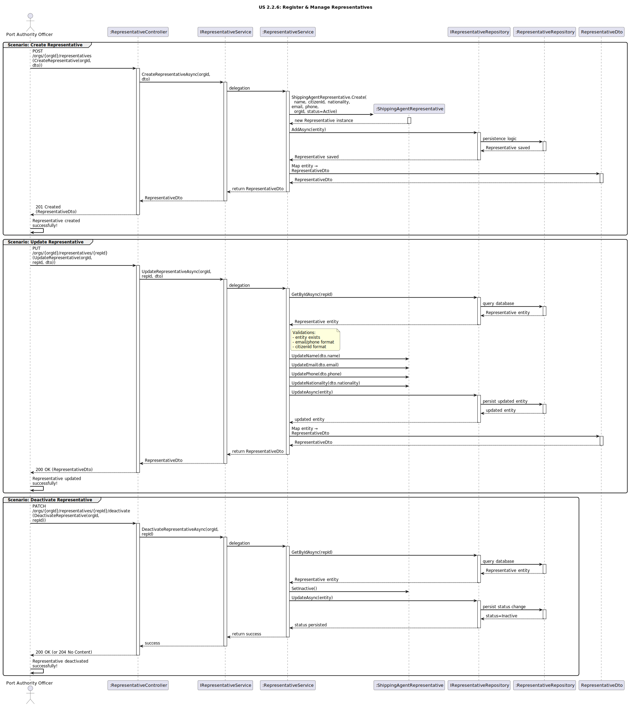

# US2.2.6 - Register and Manage Representatives

## 3. Design - User Story Realization

### 3.1. Rationale

| Interaction ID (Inferred SSD Step)                                           | Question: Which class is responsible for…                                               | Answer                                   | Justification (with patterns)                                                                                                                                     |
|:------------------------------------------------------------------------------|:----------------------------------------------------------------------------------------|:------------------------------------------|:--------------------------------------------------------------------------------------------------------------------------------------------------------------------------------------------------------|
| **Scenario: Create Representative**                                           |                                                                                         |                                          |                                                                                                                                                                                                          |
| Step 1 (Officer requests to create a representative for an organization)      | …interacting with the actor to create a representative?                                 | `RepresentativeController`                | **Controller / Adapter:** Receives HTTP request and coordinates the flow.                                                                                         |
|                                                                               | …receiving input data / converting to a transferable object?                            | `RepresentativeDto`                       | **IE:** Encapsulates data to/from the API.                                                                                                                        |
| Step 2 (System processes creation)                                            | …coordinating the creation logic?                                                       | `RepresentativeService`                   | **Application Service:** Orchestrates use case; applies rules (formats, required fields).                                                                          |
|                                                                               | …defining structure and behavior of a representative (name, citizenId, status)?         | `ShippingAgentRepresentative`             | **Domain Entity / Aggregate Root / IE:** Holds attributes and invariants; owns behavior like `Activate()`/`Deactivate()`.                                          |
|                                                                               | …linking the representative to an existing organization?                                | `RepresentativeService`                   | **Application Service:** Validates organization reference (orgId) and consistency.                                                                                 |
|                                                                               | …persisting the representative?                                                         | `RepresentativeRepository`                | **Repository (DDD):** Saves and retrieves representative aggregates.                                                                                                |
|                                                                               | …abstracting persistence operations?                                                    | `IRepresentativeRepository`               | **Interface Segregation / Pure Fabrication:** Contract for persistence.                                                                                            |
| Step 3 (System responds)                                                      | …mapping the aggregate back to a DTO?                                                   | `RepresentativeService` / `Mapper`        | **Pure Fabrication:** Centralizes mapping.                                                                                                                         |
|                                                                               | …sending confirmation of creation to the user?                                          | `RepresentativeController`                | **Controller:** Returns HTTP **201 Created** with `RepresentativeDto`.                                                                                             |
| **Scenario: Update Representative**                                           |                                                                                         |                                          |                                                                                                                                                                                                          |
| Step 1 (Officer requests to update a representative)                          | …handling the update request?                                                           | `RepresentativeController`                | **Controller / Adapter.**                                                                                                                                         |
| Step 2 (System validates and updates entity)                                  | …locating the existing representative?                                                  | `RepresentativeRepository`                | **IE:** Knows how to retrieve by id.                                                                                                                               |
|                                                                               | …validating formats (citizenId/email/phone) and domain rules?                           | `RepresentativeService`                   | **IE/Application Service:** Applies business rules; prevents invalid state.                                                                                        |
|                                                                               | …performing attribute changes (name/email/phone/nationality)?                           | `ShippingAgentRepresentative`             | **IE:** Entity owns its state; methods like `UpdateName`, `UpdateEmail`, etc.                                                                                      |
|                                                                               | …persisting the modified entity?                                                        | `RepresentativeRepository`                | **Repository:** Saves the updated aggregate.                                                                                                                       |
| Step 3 (System responds)                                                      | …preparing and returning the updated representative data?                                | `RepresentativeService` / `Mapper`        | **Pure Fabrication:** Entity→DTO mapping.                                                                                                                          |
|                                                                               | …sending confirmation of the update to the actor?                                       | `RepresentativeController`                | **Controller:** Returns HTTP **200 OK** with updated `RepresentativeDto`.                                                                                          |
| **Scenario: Deactivate Representative**                                       |                                                                                         |                                          |                                                                                                                                                                                                          |
| Step 1 (Officer requests to deactivate a representative)                      | …handling the deactivate request?                                                       | `RepresentativeController`                | **Controller.**                                                                                                                                                    |
| Step 2 (System sets status and persists)                                      | …loading the representative and changing status to inactive?                            | `ShippingAgentRepresentative`             | **Domain Behavior / IE:** Method like `Deactivate()` (or `SetInactive()`), preserving invariants (no delete).                                                     |
|                                                                               | …persisting the status change?                                                          | `RepresentativeRepository`                | **Repository:** Persists state transition.                                                                                                                         |
| Step 3 (System responds)                                                      | …returning success to the actor?                                                        | `RepresentativeController`                | **Controller:** Returns **200 OK** or **204 No Content**.                                                                                                          |

---

### Systematization

According to the rationale, the following conceptual classes were promoted to software classes in the system:

#### **Domain Layer**
- `ShippingAgentRepresentative` – Aggregate root representing a representative (name, citizenId, nationality, email, phone, status, orgId).
- *(Optionally as VOs)* `RepresentativeId`, `RepresentativeName`, `CitizenId`, `Nationality`, `Email`, `Phone`, `RepresentativeStatus`.

#### **Application Layer**
- `IRepresentativeService` – Defines operations to create, update and deactivate representatives.
- `RepresentativeService` – Implements business logic and validations; coordinates domain and persistence.

#### **Infrastructure Layer**
- `IRepresentativeRepository` – Contract for persistence operations.
- `RepresentativeRepository` – Concrete repository for representatives.

#### **Presentation Layer**
- `RepresentativeController` – Handles HTTP requests (Create, Update, Deactivate).
- `RepresentativeDto` – DTO for input/output.

---

### Full Diagram

The following diagram shows the complete design realization for **Register & Manage Representatives** (covering **Create**, **Update**, and **Deactivate** scenarios).

