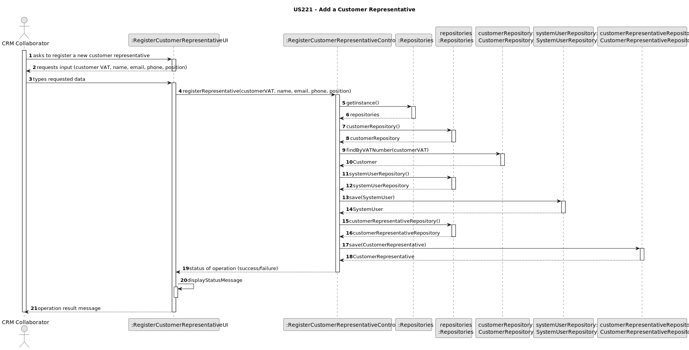
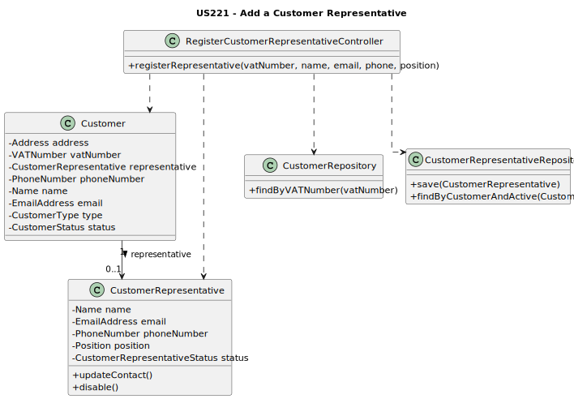

# US221 - Add a Customer Representative

## 3. Design - User Story Realization

### 3.1. Rationale

_**Note that SSD - Alternative One is adopted.**_

| Interaction ID                                                 | Question: Which class is responsible for...         | Answer                          | Justification (with patterns)                                                                                  |
|:---------------------------------------------------------------|:----------------------------------------------------|:--------------------------------|:---------------------------------------------------------------------------------------------------------------|
| Step 1 (Asks to add a customer representative.)                | ... interacting with the actor?                     | RegisterCustomerRepresentativeUI | Pure Fabrication: there is no reason to assign this responsibility to any existing class in the Domain Model.  |
|                                                                | ... coordinating the US?                            | RegisterCustomerRepresentativeController | Controller: Coordinates the user story.                                                       |
| Step 2 (Requests data: customer VAT, name, email, phone, position) | ... displaying the form for input data?             | RegisterCustomerRepresentativeUI | IE: Responsible for user interaction.                                                                         |
| Step 3 (Types requested data)                                  | ... temporarily keeping the inputted data?          | RegisterCustomerRepresentativeUI | IE: Responsible for temporarily keeping inputted data.                                                        |
|                                                                | ... validating existence of the customer?           | CustomerRepository               | IE: Knows all the customers.                                                                                   |
|                                                                | ... validating global uniqueness of user email?     | SystemUserRepository             | IE: Knows all the system users.                                                                                |
|                                                                | ... instantiating a new SystemUser?                 | SystemUserRepository             | Creator Pattern: Repository has all SystemUsers and knows creation rules.                                      |
|                                                                | ... instantiating a new CustomerRepresentative?     | CustomerRepresentativeRepository | Creator Pattern: Repository has all CustomerRepresentatives.                                                  |
|                                                                | ... saving the new SystemUser?                      | SystemUserRepository             | IE: Manages persistence of SystemUsers.                                                                        |
|                                                                | ... saving the new CustomerRepresentative?          | CustomerRepresentativeRepository | IE: Manages persistence of CustomerRepresentatives.                                                           |
| Step 4 (Displays status of operation (success or failure))     | ... informing operation success?                    | RegisterCustomerRepresentativeUI | IE: Responsible for user interaction.                                                                         |

---

### Systematization

According to the taken rationale, the conceptual classes promoted to software classes are:

* `Customer`
* `SystemUser`
* `CustomerRepresentative`

Other software classes (i.e. Pure Fabrication) identified:

* `RegisterCustomerRepresentativeUI`
* `RegisterCustomerRepresentativeController`
* `CustomerRepository`
* `SystemUserRepository`
* `CustomerRepresentativeRepository`

### Full Diagram

This diagram shows the full sequence of interactions between the classes involved in the realization of this user story (see SSD for reference).

## 3.3. Class Diagram (CD)

