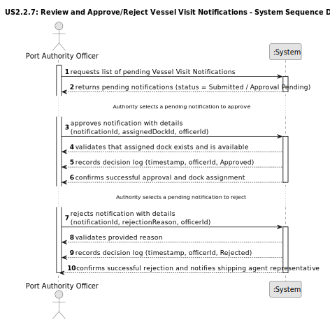

# US 2.2.7 - Review and Approve/Reject Vessel Visit Notifications

## 1. Requirements Engineering

### 1.1. User Story Description

As a Port Authority Officer, I want to review pending Vessel Visit Notifications and approve or reject them, so that docking schedules remain under port control.

### 1.2. Customer Specifications and Clarifications 

**From the specifications document:**
> A Vessel Visit represents the planned arrival and departure of a vessel at the port, including associated operations such as cargo loading and unloading. 
> The process begins when a shipping agent representative submits a Vessel Visit Notification for an authorized vessel, providing key information such as expected arrival (ETA), departure (ETD), cargo type and volume, and any special handling requirements.
>
>The Port Authority reviews the notification and decides to approve or reject it. If the visit is rejected, a reason must be provided to the agent, such as missing documentation or dock unavailability. 
> If the visit is approved, a dock is assigned, potentially with support from an intelligent algorithm that considers pending visits, vessel type, dock capacity, and other operational constraints.
>
>(System Specification, Section 3.1.5 – Vessel Visits)
> 
**From the client clarifications:**

> **Question:** When approving a Vessel Visit, must the officer immediately assign a dock?
>
> **Answer:** Yes. When the visit is approved, the officer must select a dock (temporary assignment), either manually or through a supported automatic suggestion system.

> **Question:** Are approval and rejection decisions stored for audit purposes?
>
> **Answer:** Yes. Every decision (approve/reject) must be logged with timestamp, officer ID, and outcome.

> **Question:** Can a rejected notification be resubmitted?
>
> **Answer:** Yes, after correction by the shipping agent representative, it can be resubmitted for a new decision.

### 1.3. Acceptance Criteria

* **AC1:** When a notification is approved, the officer must assign a (temporary) dock on which the vessel will berth.
* **AC2:** When a notification is rejected, the officer must provide a reason for rejection (e.g., missing information).
* **AC3:** If rejected, the shipping agent representative can update and resubmit the notification for further review.
* **AC4:** All decisions (approve/reject) must be logged with timestamp, officer ID, and decision outcome for auditing.

### 1.4. Found out Dependencies

* Depends on US 2.2.2 – Register and Update Vessel Records, as each Vessel Visit references a registered vessel.
* Depends on US 2.2.3 – Register and Update Docks, since an approved visit requires selecting an available dock.
* Depends on US 2.2.8 / 2.2.9 – Create and Update Vessel Visit Notifications, which define the notification submission process.
* Requires persistent storage of decisions for auditing and traceability.

### 1.5 Input and Output Data

**Input Data (Review Notification):**
 * `notificationId` (string): Identifier of the Vessel Visit Notification under review.
 * `decision` (enum): Either “Approved” or “Rejected”.
 * `assignedDockId` (string, optional): Identifier of the selected dock (required if approved).
 * `rejectionReason` (string, optional): Explanation provided when the decision is rejection.
 * `officerId` (string): Identifier of the Port Authority Officer performing the review.

**Output Data (Review Notification):**
 * Successful approval: Confirmation message including assigned dock and decision details.
 * Successful rejection: Confirmation message with stored rejection reason.
 * Failed operation: Error message (e.g., “Notification not found”, “Dock unavailable”, “Invalid decision data”).

**Input Data (Search Pending Notifications):**
 * `status` (enum): Filter by “Submitted / Approval Pending”.

**Output Data (Search Pending Notifications):**
 * `notificationsList` (list): List of pending Vessel Visit Notifications awaiting decision

### 1.6. System Sequence Diagram (SSD)
The following SSD illustrates the system interactions for reviewing, approving, and rejecting Vessel Visit Notifications.

### 1.7 Other Relevant Remarks
* Every decision (approval or rejection) must be recorded in a Decision Log with timestamp, officer ID, and outcome.
* Once approved, the assigned dock remains temporary until the vessel visit is scheduled and confirmed.
* Rejected notifications can be edited and resubmitted by the shipping agent representative for further review.
* The system must ensure that only authorized officers can perform approval/rejection operations.
* Audit logs should be retrievable for inspection and compliance checks.