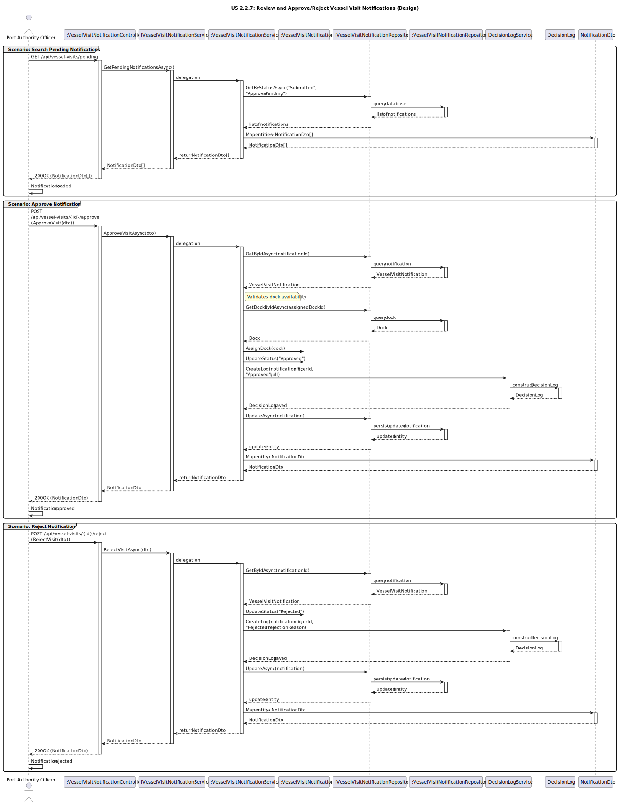

# US2.2.3 - Create and Update Docks

## 3. Design - User Story Realization

### 3.1. Rationale

| Interaction ID (Inferred SSD Step)                 | Question: Which class is responsible for...                            | Answer                                    | Justification (with patterns)                                                                                                    |
|:---------------------------------------------------|:-----------------------------------------------------------------------|:------------------------------------------|:---------------------------------------------------------------------------------------------------------------------------------|
| **Scenario: Create Dock**                          |                                                                        |                                           |                                                                                                                                  |
| Step 1 (Officer requests pending notifications)    | ... interacting with the actor to retrieve pending notifications?      | `VesselVisitNotificationController`       | **Controller / Adapter:** Handles the HTTP request and coordinates the creation flow between layers.                             |
|                                                    | ... filtering notifications by status?                                 | `VesselVisitNotificationService`          | **Information Expert (IE):**  Knows how to query notifications with status Submitted or Approval Pending.                        |
| Step 2 (Officer selects a notification to review ) | ... validating the notification and decision input?                    | `VesselVisitNotificationService`          | **Information Expert (IE):** Validates dock availability, decision format, and notification existence.                           |
|                                                    | ... assigning a dock to the vessel visit?                              | `VesselVisitNotificationService `         | **Application Service / Controller:** Coordinates dock assignment and updates visit status.                                      |
|                                                    | ... updating the notification status (Approved/Rejected)?              | `VesselVisitNotificationService `         | **Information Expert (IE):** Owns business logic for status transitions.                                                         |
|                                                    | ... persisting the modified notification and decision?                 | `VesselVisitNotificationRepository`       | **Repository (DDD Pattern):** Responsible for saving updated notification and decision log.                                      |
|                                                    | ... abstracting persistence operations?                                | `IVesselVisitNotificationRepository`      | **Interface Segregation / Pure Fabrication:** Defines repository contracts, enabling decoupling between service and persistence. |
| Step 3 (System responds)                           | ... mapping the entity to a DTO and returning it to the user?          | `VesselVisitNotificationService / Mapper` | **Pure Fabrication:** Converts the updated entity into a NotificationDto.                                                        |
|                                                    | ... sending confirmation of the decision to the user?                  | `VesselVisitNotificationController`       | **Information Expert (IE):** Returns HTTP 200 OK with the updated notification details.                                          |

---

### Systematization

According to the rationale, the following conceptual classes were promoted to software classes in the system:

#### **Domain Layer**
- `VesselVisitNotification` – Entity representing a vessel visit and its review status.
- `DecisionLogEntry` - Value Object embedded in the notification to store decision type, timestamp, officerId, and optional rejection reason.

#### **Application Layer**
- `IVesselVisitNotificationService` – Interface defining operations for reviewing notifications.
- `VesselVisitNotificationService` – Implements review logic, dock assignment, and decision recording.

#### **Infrastructure Layer**
- `IVesselVisitNotificationRepository` – Interface defining persistence operations.
- `VesselVisitNotificationRepository` – Implements the data access layer for notifications.

#### **Presentation Layer**
- `VesselVisitNotificationController` – Handles HTTP requests for review actions.
- `ApproveVvnDto / RejectVvnDto` – DTOs for submitting review decisions.
- `VesselVisitNotificationDto` – DTO for returning updated notification details.

---

### Full Diagram

The following diagram shows the complete design realization for the Review and Approve/Reject Vessel Visit Notifications user story (covering Search, Approve, and Reject scenarios).

