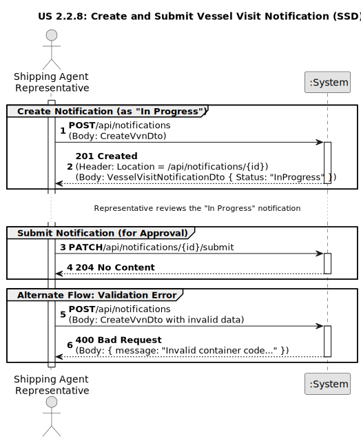

# US 2.2.8: Create/Submit a Vessel Visit Notification

## 1. Requirements Engineering

### 1.1. User Story Description

As a Shipping Agent Representative, I want to create/submit a Vessel Visit Notification, so that the vessel berthing and subsequent (un)loading operations at the port are scheduled and planned in space and timely manner.

### 1.2. Customer Specifications and Clarifications

* **Process Initiation:** The process begins when a shipping agent representative submits a Vessel Visit notification for an authorized vessel, providing key information such as expected arrival (ETA), departure (ETD), cargo type and volume, and any special handling requirements.
* **Crew Information:** The notification may also include basic crew information. If the vessel carries dangerous cargo, the notification must explicitly identify the designated crew safety officers. The C# code implements this with a `CreateCrewMemberDto` that includes an `IsSafetyOfficer` boolean flag.
* **Cargo Manifest:** Cargo Manifests are submitted by the shipping agent together with the Vessel Visit notification.
* **Container Validation:** To ensure global interoperability, containers are identified using the ISO 6346:2022 standard, which defines a unique identifier and a single check digit for validation. This is enforced in the code by the `ContainerCode` value object, which validates the format and check digit upon creation.

### 1.3. Acceptance Criteria

* **AC1:** The Cargo Manifest data for unloading and/or loading is included.
* **AC2:** The system must validate that referred containers identifiers comply with the ISO 6346:2022 standard.
* **AC3:** Information about the crew (name, citizen id, nationality) might be requested, when necessary, for compliance with security protocols.
* **AC4:** Vessel Visit Notifications might become at an "in progress" status (e.g. cargo information is incomplete) to be further update/completed.
* **AC5:** When completed / ready for asking approval, the agent is required to change its state to "submitted".

### 1.4. Found out Dependencies

* **US 2.2.2 (Manage Vessel Records):** A Vessel Visit Notification must be associated with a valid, existing `Vessel` (identified by its `ImoNumber`). The system enforces this with a foreign key constraint.
* **US 2.2.6 (Manage Representatives):** The notification must be submitted by an authorized `ShippingAgentRepresentative` (identified by `RepresentativeId`). This is also enforced by a foreign key constraint.
* **US 2.2.7 (Approve/Reject VVN):** This user story (2.2.8) is a prerequisite for US 2.2.7. The "submit" action transitions the VVN into the `Submitted` state, which is the state required for a Port Authority Officer to approve or reject it.

### 1.5. Input and Output Data

**Input Data (Create Notification):**

* This corresponds to the `CreateVvnDto`.
* `EstimatedArrival` (DateTime)
* `EstimatedDeparture` (DateTime)
* `VesselImo` (string)
* `RepresentativeId` (string)
* `Cargo` (CreateCargoDto):
    * `Description` (string)
    * `Weight` (double)
    * `Containers` (List<CreateContainerDto>):
        * `ContainerCode` (string)
        * `Position` (string)
* `CrewMembers` (List<CreateCrewMemberDto>):
    * `Name` (string)
    * `Nationality` (string)
    * `IsSafetyOfficer` (bool)

**Output Data (Create Notification):**

* **Success:** A `VesselVisitNotificationDto` with `Status = "InProgress"` and an HTTP 201 Created status.
* **Failure (Validation):** An HTTP 400 Bad Request if validation fails (e.g., invalid `ContainerCode`, ETA >= ETD, or missing `RepresentativeId`).
* **Failure (Database):** An HTTP 400 Bad Request if a Foreign Key constraint fails (e.g., `VesselImo` or `RepresentativeId` does not exist).

**Input Data (Submit Notification):**

* `notificationId` (string, from URL path).

**Output Data (Submit Notification):**

* **Success:** An HTTP 204 No Content status.
* **Failure:** An HTTP 404 Not Found if the ID doesn't exist, or an HTTP 409 Conflict if the notification is not in the `InProgress` state.

### 1.6. System Sequence Diagram (SSD)

The following SSD illustrates the two-step process for this user story: first creating the notification as a draft ("In Progress") and then separately submitting it for approval.

*(Diagram generated from [us2.2.8-system-sequence-diagram.puml](puml/us2.2.8-ssd.puml))*