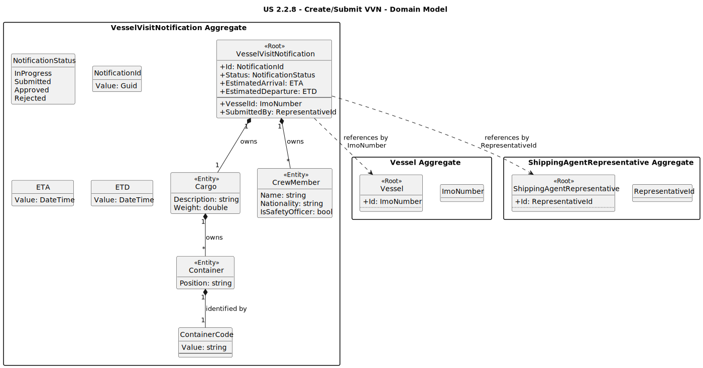

# US 2.2.8: Create/Submit VVN - Analysis Domain Model

This diagram illustrates the domain model for the `VesselVisitNotification` aggregate. It is the central entity for this user story, responsible for its own state and validity.

*(Diagram generated from [us2.2.8-domain-model.puml](puml/us2.2.8-domain-model.puml))*

## Key Domain Concepts

* **VesselVisitNotification**: This is the **Aggregate Root**. It encapsulates all the data and business rules related to a single vessel visit. Its constructor ensures that it is always created in the `"InProgress"` state, fulfilling **AC4**. It exposes methods like `Submit()` which enforce business rules (e.g., "can only submit if 'InProgress'"), fulfilling **AC5**.

* **NotificationStatus**: A simple enum (`InProgress`, `Submitted`, `Approved`, `Rejected`) that defines the state machine for the notification's lifecycle.

* **Cargo, Container, CrewMember**: These are **Owned Entities** within the aggregate. They do not have their own identity outside of the `VesselVisitNotification` and are always managed *by* it.

* **ContainerCode**: This is a **Value Object** that represents the ISO 6346 identifier. Its constructor contains the validation logic (regex format and check digit algorithm) to ensure that no invalid container code can ever exist within the system, fulfilling **AC2**.

* **Vessel (by ImoNumber)** & **ShippingAgentRepresentative (by RepresentativeId)**: These are references to *other* aggregates. The `VesselVisitNotification` does not hold the entire `Vessel` or `Representative` object, only their unique IDs. This maintains low coupling between aggregates.