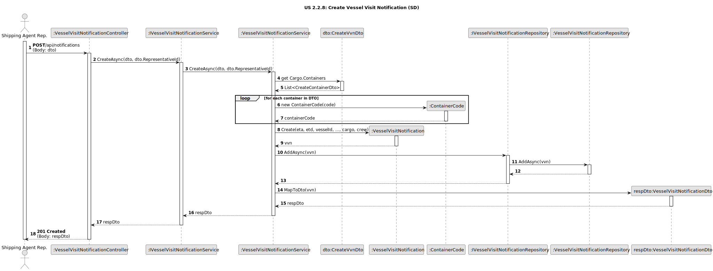
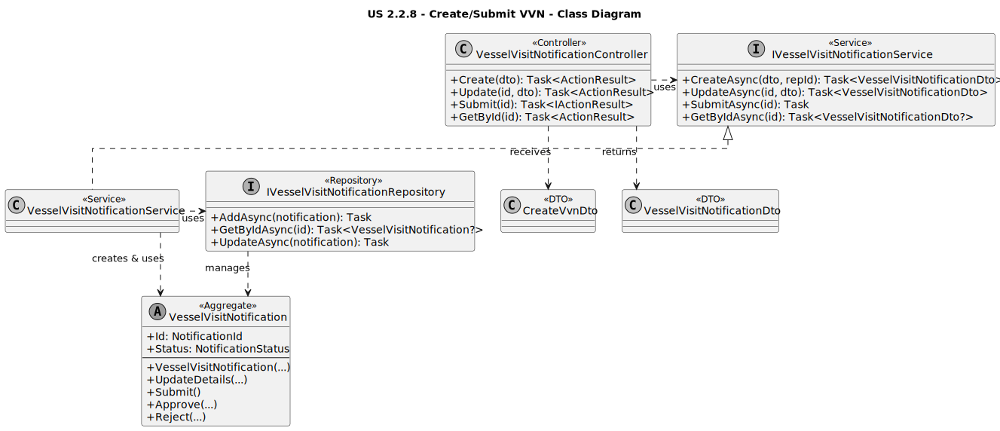

# US 2.2.8: Create/Submit VVN - Design

## 3.1. Rationale

The design follows a layered architecture, separating concerns to ensure the system is maintainable, testable, and robust. Business rules are enforced at the correct level (domain model).

| Interaction | Question: Which class is responsible for... | Answer | Justification (with patterns) |
| :--- | :--- | :--- | :--- |
| **Step 1 (Receive Request)** | ...handling the HTTP `POST` and `PATCH` requests from the actor? | `VesselVisitNotificationController` | **Controller (GRASP):** This class is the dedicated entry point for all API interactions related to notifications. It handles HTTP verbs, validates DTOs, and translates requests into application service calls. |
| | ...coordinating the steps of the use case (e.g., "create", "submit")? | `VesselVisitNotificationService` | **Service Layer / Pure Fabrication:** This class orchestrates the operation. It fetches domain entities, calls their methods, and uses repositories to persist them. It does not contain business logic itself (e.g., `CreateAsync`, `SubmitAsync`). |
| **Step 2 (Execute Logic)** | ...validating the ISO 6346 container code format and check digit? | `ContainerCode` | **Information Expert (GRASP):** This Value Object is the expert on its own validity. By performing validation in its constructor, it guarantees that an invalid `ContainerCode` cannot exist in the domain. |
| | ...ensuring a new notification always starts with the status "InProgress"? | `VesselVisitNotification` (Aggregate) | **Information Expert (GRASP):** The aggregate root is responsible for its own creation and consistency. Its constructor explicitly sets the status to `InProgress`, fulfilling **AC4**. |
| | ...enforcing the business rule that *only* an "InProgress" notification can be submitted? | `VesselVisitNotification` (Aggregate) | **Information Expert (GRASP) / Protected Variations:** The `Submit()` method on the aggregate contains the state check (`if (Status != NotificationStatus.InProgress)`). This protects the entity's state from invalid transitions. |
| **Step 3 (Persist State)** | ...saving the new `VesselVisitNotification` aggregate to the database? | `IVesselVisitNotificationRepository` | **Repository:** This interface abstracts the database persistence, allowing the service to save the aggregate without knowing about Entity Framework or SQL. |
| **Step 4 (Send Response)** | ...transforming the `VesselVisitNotification` entity into a DTO for the response? | `VesselVisitNotificationService` | **Service Layer / DTO:** The service uses a private `MapToDto` method to convert the internal domain entity into a "safe" data transfer object (`VesselVisitNotificationDto`) for the client. |

## 3.2. Sequence Diagram (SD)

This diagram shows the sequence of interactions for the **Create Vessel Visit Notification** scenario, which highlights the ISO 6346 validation and the creation of the entity in the "InProgress" state.

*(Diagram generated from [us2.2.8-sequence-diagram.puml](puml/us2.2.8-sequence-diagram.puml))*

## 3.3. Class Diagram (CD)

This diagram shows the main classes, interfaces, and DTOs involved in implementing this use case, reflecting the C# project structure.

*(Diagram generated from [us2.2.8-class-diagram.puml](puml/us2.2.8-class-diagram.puml))*