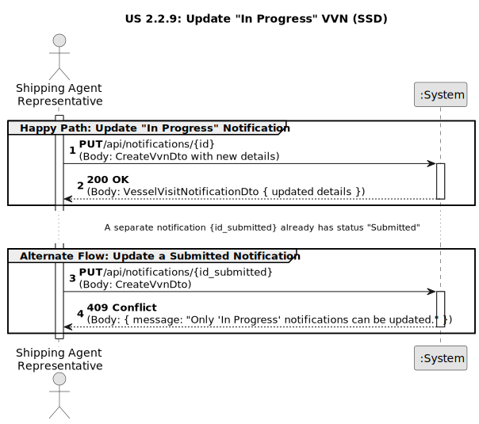

# US 2.2.9: Change/Complete a VVN - Requirements Engineering

## 1. Requirements Engineering

### 1.1. User Story Description

[cite_start]As a Shipping Agent Representative, I want to change / complete a Vessel Visit Notification while it is still in progress, so that I can correct errors or withdraw requests if necessary[cite: 2004].

### 1.2. Customer Specifications and Clarifications

* **Context:** This use case is a follow-up to the creation part of US 2.2.8. [cite_start]After a notification is created, it exists in an `"in progress"` state[cite: 2002].
* [cite_start]**Function:** This user story allows the representative to modify all the details of that notification (like ETA/ETD, crew, or cargo manifests) *only* during this "in progress" window [cite: 1544-1545].
* [cite_start]**Business Rule:** Once the notification is "submitted" (as per US 2.2.8) or "approved"/"rejected" (as per US 2.2.7), it becomes locked, and this update operation is no longer permitted [cite: 1544-1545].

### 1.3. Acceptance Criteria

* [cite_start]**AC1:** Status can be maintained "in progress" or changed to "submitted / approval pending" by the representative[cite: 2006]. (This documentation focuses on the "update" part, which keeps the status "in progress").

### 1.4. Found out Dependencies

* **US 2.2.8 (Create/Submit VVN):** This use case can only be performed on a `VesselVisitNotification` that was successfully created via US 2.2.8 and has not yet been submitted.

### 1.5. Input and Output Data

**Input Data (Update Notification):**

* `notificationId` (string, from URL path).
* [cite_start]This corresponds to the `CreateVvnDto` (used for both create and update) [cite: 691-692, 945].
* `EstimatedArrival` (DateTime)
* `EstimatedDeparture` (DateTime)
* `VesselImo` (string)
* `RepresentativeId` (string)
* `Cargo` (CreateCargoDto)
* `CrewMembers` (List<CreateCrewMemberDto>)

**Output Data (Update Notification):**

* **Success:** A `VesselVisitNotificationDto` with the updated details and an HTTP 200 OK status.
* **Failure (Not Found):** An HTTP 404 Not Found if the `{id}` does not exist.
* **Failure (Business Rule):** An HTTP 409 Conflict if the notification is *not* in the `"InProgress"` state (e.g., it's already `"Submitted"` or `"Approved"`).

### 1.6. System Sequence Diagram (SSD)

The following SSD illustrates the "happy path" interaction for updating a notification and the "alternate flow" where the update is rejected due to a business rule.

*(Diagram generated from [us2.2.9-ssd.puml](puml/us2.2.9-ssd.puml))*