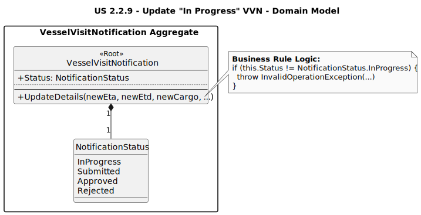

# US 2.2.9: Change/Complete VVN - Analysis Domain Model

This diagram illustrates the key business rule for this use case, which is enforced by the `VesselVisitNotification` aggregate root.

*(Diagram generated from [us2.2.9-domain-model.puml](puml/us2.2.9-domain-model.puml))*

## Key Domain Concepts

* **VesselVisitNotification**: The **Aggregate Root**. It is the only component that should be responsible for its own state and consistency.
* **UpdateDetails(...)**: This is the domain method that encapsulates the business logic for this user story.
* **NotificationStatus**: This enum represents the state of the aggregate.
* **Business Rule Enforcement:** The `UpdateDetails` method contains a "guard clause" that checks the `NotificationStatus`. [cite_start]If the status is *not* `InProgress`, the method throws an `InvalidOperationException` [cite: 1544-1545]. This is the core of this use case and perfectly implements the requirement that only "in progress" notifications can be changed.