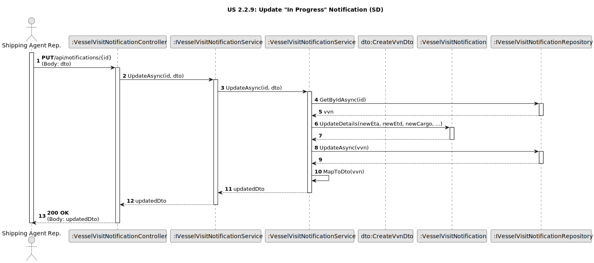
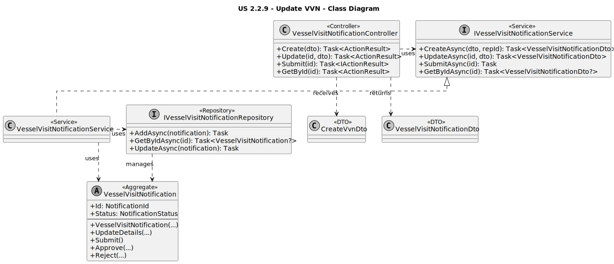

# US 2.2.9: Change/Complete VVN - Design

## 3.1. Rationale

The design follows a layered architecture. The responsibility for enforcing the "in progress" business rule is correctly placed in the domain aggregate, not in the service or controller.

| Interaction | Question: Which class is responsible for... | Answer | Justification (with patterns) |
| :--- | :--- | :--- | :--- |
| **Step 1 (Receive Request)** | ...handling the HTTP `PUT` request? | [cite_start]`VesselVisitNotificationController` [cite: 945] | **Controller (GRASP):** This class is the API entry point. It receives the `PUT` request, the `{id}`, and the `CreateVvnDto` body. |
| **Step 2 (Orchestrate)** | ...coordinating the update operation? | [cite_start]`VesselVisitNotificationService` [cite: 724-728] | **Service Layer / Pure Fabrication:** The `UpdateAsync` method orchestrates the use case. It is responsible for 1) fetching the aggregate and 2) calling its domain method. |
| | ...finding the correct `VesselVisitNotification` aggregate? | `IVesselVisitNotificationRepository` | **Repository:** Abstracts the data access. The service uses `GetByIdAsync` to retrieve the aggregate from the database. |
| **Step 3 (Execute Logic)** | ...enforcing the rule that only "In Progress" notifications can be updated? | [cite_start]`VesselVisitNotification` (Aggregate) [cite: 1544-1545] | **Information Expert (GRASP):** The aggregate root is the expert on its own state. The `UpdateDetails` method *first* checks its `Status` and throws an `InvalidOperationException` if the rule is violated. This is the core business logic. |
| **Step 4 (Persist State)** | ...saving the changes to the aggregate? | `IVesselVisitNotificationRepository` (via `DbContext`) | **Repository / Unit of Work:** The service calls `SaveChangesAsync()` on the `DbContext` (or `UpdateAsync` on the repo). Because the aggregate was retrieved, any changes made to it (by `UpdateDetails`) are tracked and persisted. |
| **Step 5 (Send Response)** | ...transforming the updated entity into a response DTO? | [cite_start]`VesselVisitNotificationService` [cite: 917-923] | **Service Layer / DTO:** The service's `MapToDto` method converts the updated domain entity into a `VesselVisitNotificationDto` to send back to the client. |

## 3.2. Sequence Diagram (SD)

This diagram shows the sequence of interactions for the **Update Notification** scenario, highlighting where the business rule is checked.

*(Diagram generated from [us2.2.9-sequence-diagram.puml](puml/us2.2.9-sequence-diagram.puml))*

## 3.3. Class Diagram (CD)

This diagram shows the main classes, interfaces, and DTOs involved. It is identical to the one for US 2.2.8, as the same components are responsible for both creating and updating the notification.

*(Diagram generated from [us2.2.9-class-diagram.puml](puml/us2.2.9-class-diagram.puml))*