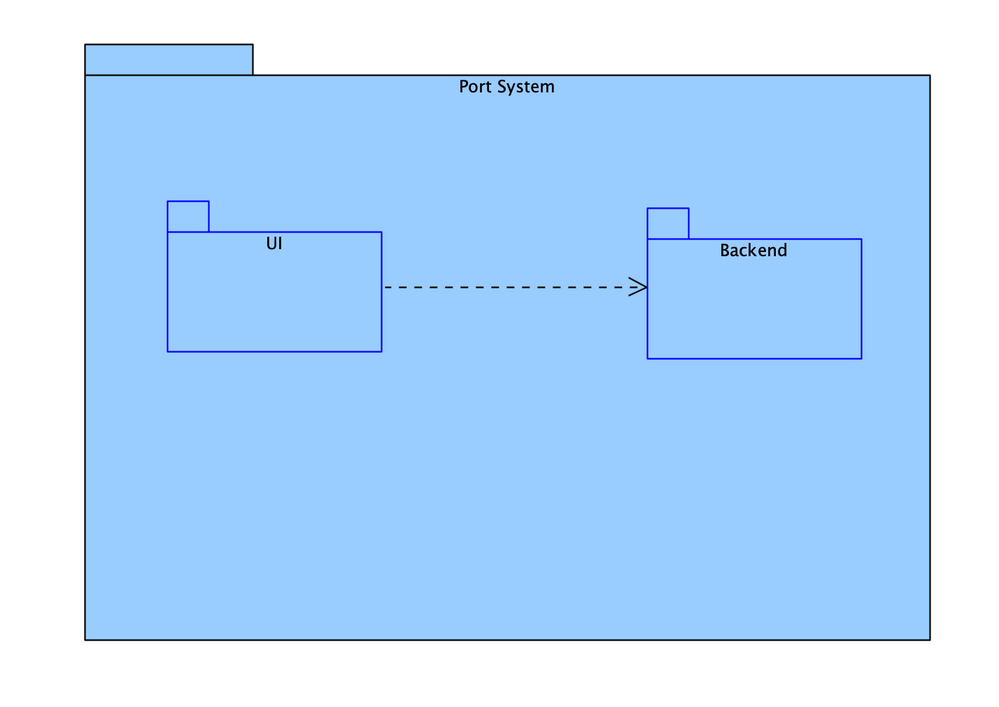
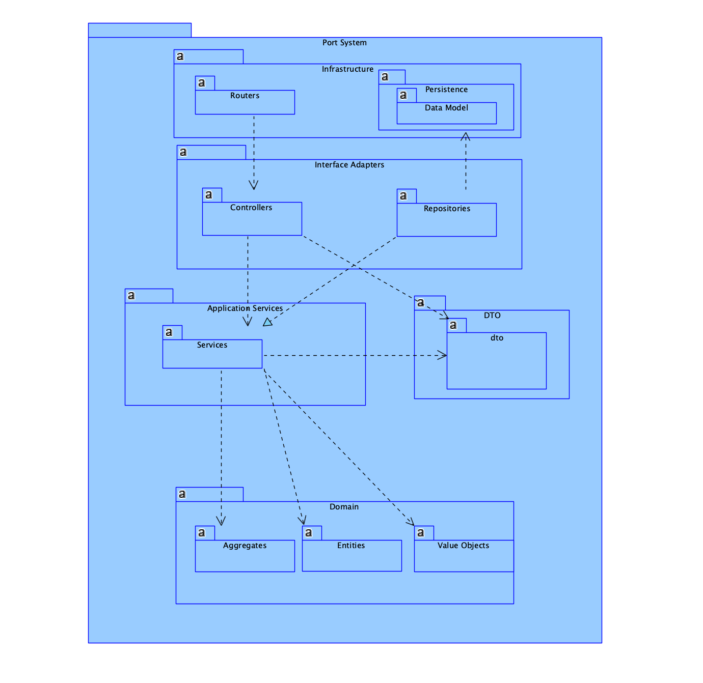
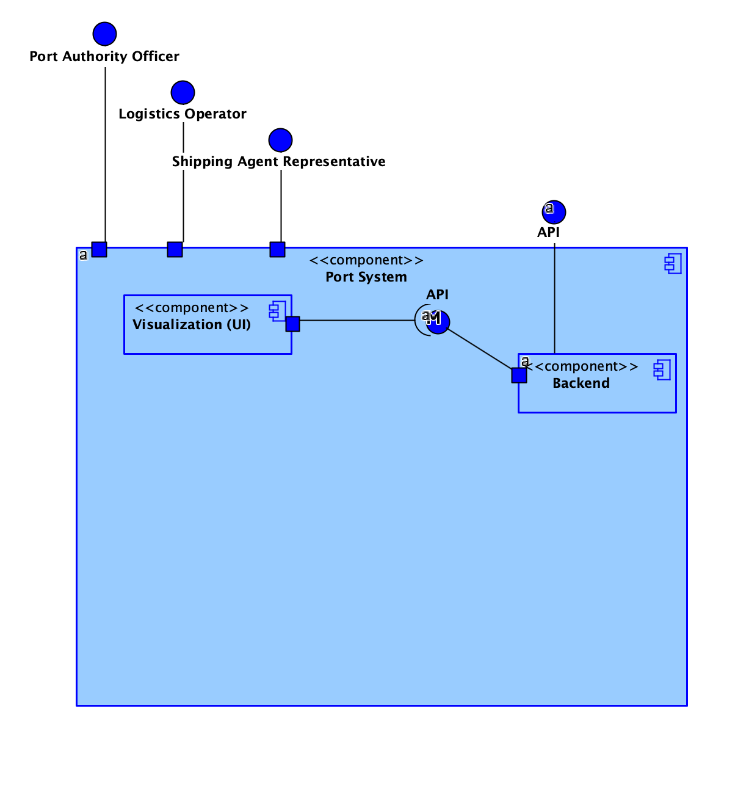
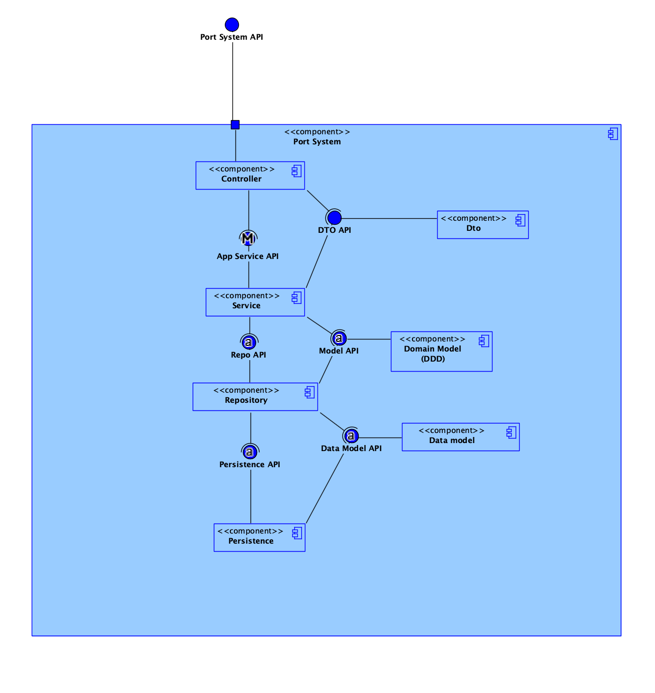
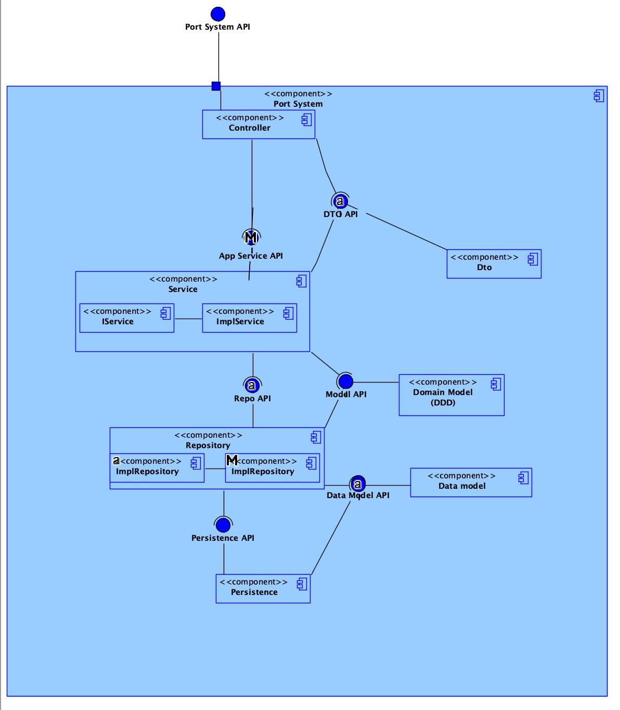
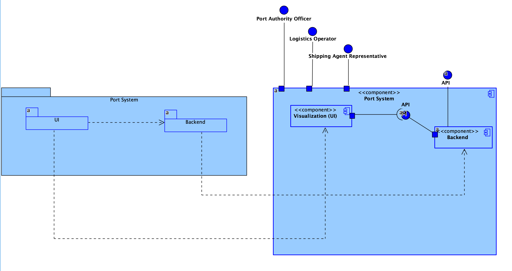
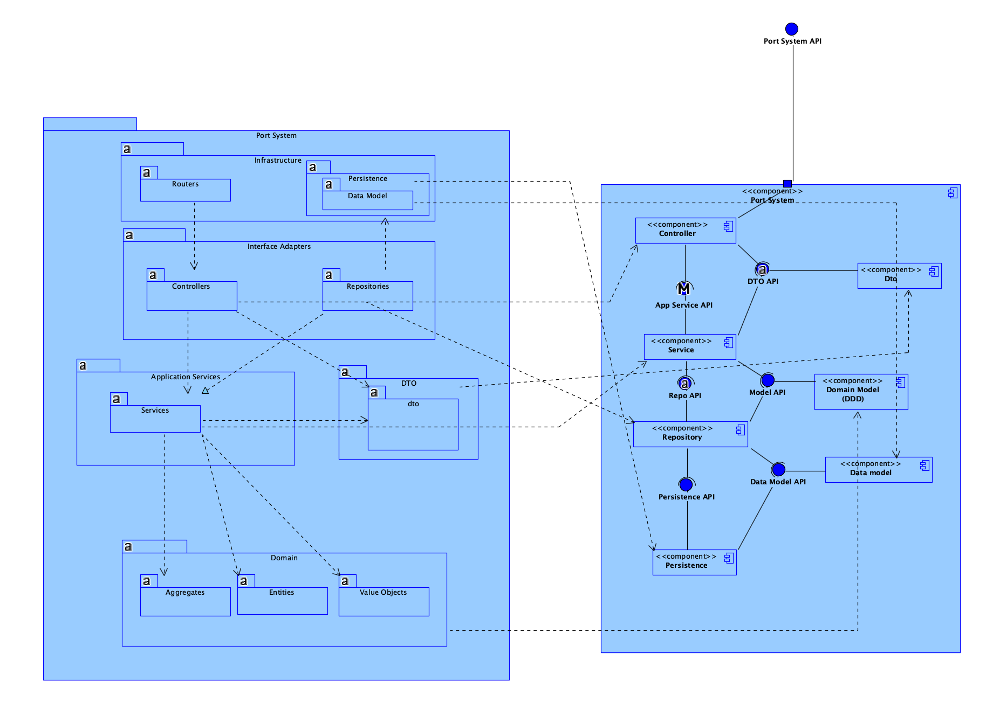
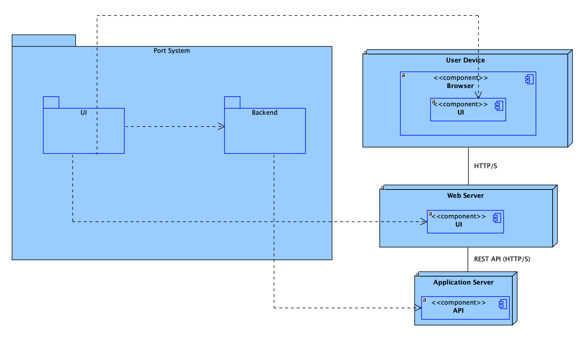

# README — Views

Overview
--------
This folder contains the diagrams organized by architectural views used in Sprint A of the project. The diagrams document different perspectives of the system: logic, implementation, processes, physical and the mappings between those views.

Folder structure
----------------
- `ImplementationViewDiagrams/` — diagrams for the implementation view.
- `LogicViewDiagrams/` — diagrams for the logic view.
- `PhysicalView/` — diagrams for the physical view (deployment, infra).
- `ProcessViewDiagrams/` — diagrams for the process view (runtime, concurrent executions, workflows).
- `Mapping/` — mappings and traceability between elements across different diagrams.

Levels (N1 — N4) — general explanation
-------------------------------------
These levels represent the granularity/abstraction of the diagrams, from the most conceptual to the most detailed:
- N1 — Strategic / conceptual overview (macro): goals, main subsystems and boundaries. Ideal for stakeholders and high-level overview.
- N2 — Subsystem / component view (modules): separation into subsystems, APIs between modules, main dependencies.
- N3 — Low-level view / classes & services: internal structures of modules, main classes, contracts and internal flows.
- N4 — Deployment / instance view: internal structures of modules, detailed classes, interfaces, contracts and flows in runtime/instance context.

(The following explanations apply these levels to each specific view and show the embedded images.)

1) Implementation View

Meaning of this view:
- Shows how the system is implemented: packages, modules, services, classes and technical dependencies.

Levels applied to the Implementation View:
- N1 (`diagram1.png`): macro view of the component architecture and module boundaries.
- N2 (`diagram2.png`): subdivision into subsystems and interface contracts.
- N3 (`diagram3.png`): details of main classes/services and internal interactions.
- N4 (`diagram4.png`): detailed classes and interfaces relative to the previous levels.

Images (embedded):

*Implementation N1 — macro view of components.*

*Implementation N2 — subsystems and contracts.*

*Implementation N3 — classes/services and relations.*

*Implementation N4 — detailed classes and interfaces.*

2) Logic View (conceptual / domain view)

Meaning of this view:
- Represents the domain model and business rules at different levels of detail.

Levels applied to the Logic View:
- N1 (`diagram1.png`): conceptual view of the domain.
- N2 (`diagram2.png`): UI and backend boundaries.
- N3 (`diagram3.png`): use-case classes and interactions.
- N4 (`diagram4.png`): detailed classes, interfaces and interactions.

Images (embedded):

*Logic N1 — conceptual view of the domain.*

*Logic N2 — UI and backend boundaries.*

*Logic N3 — use-case classes and interactions.*

*Logic N4 — detailed classes, interfaces and interactions.*

3) Physical View (deployment)

Meaning of this view:
- Shows the distribution of artifacts in the physical environment: servers, containers, networks, databases and how services connect.

Levels applied to the Physical View (examples):

- N2: mapping of subsystems to nodes (applications ↔ servers/containers).

Images (embedded):

*Physical N2 — mapping of subsystems to physical/virtual nodes.*

4) Process View (runtime / processes)

Meaning of this view:
- Focuses on dynamic behavior: workflows, asynchronous messages, concurrency and execution scenarios.

Levels applied to the Process View:
- N1: overview of flows and major actors (e.g., orchestration between large blocks).
- N2: flows by subsystem / main communication channels.
- N3: detailed sequence diagrams between services/actors.
- N4: detailed sequence diagrams including interfaces.

Images (embedded):

(There are no PNG images currently embedded for `ProcessViewDiagrams`.)

5) Mapping (traceability between views)

Meaning of this view:
- Shows where elements from the logic view (entities, aggregates) are implemented and how they map to physical deployment.

Levels applied to Mapping (examples):
- N2: high-level mappings (e.g., which module implements each aggregate).
- N3: direct links between classes/interfaces and physical components.

Images (embedded):

*Mapping — link between implementation and logical model (N2).* 

*Mapping — detailed link between implementation artifacts and logical elements (N3).* 

*Mapping — where each component is deployed in the physical environment (N3).*
