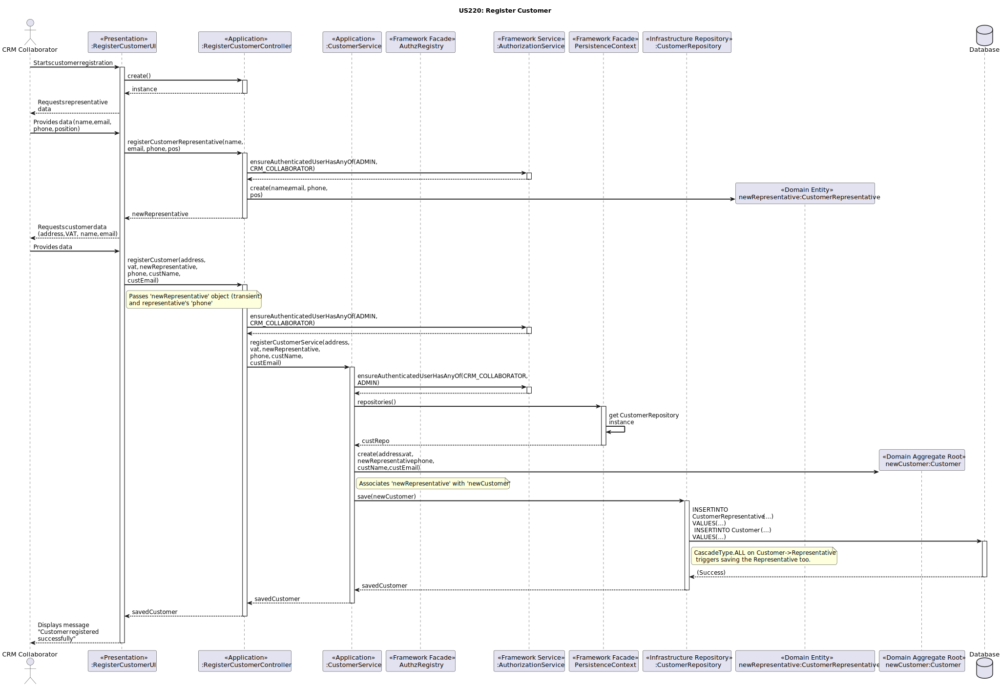

# US220 - Register customer

## 3. Design - User Story Realization

### 3.1. Rationale

_**Note: The design below is based on the provided Sequence Diagram for US220. SSD steps are inferred from the "Requirements Engineering" section of US220 for this rationale table. The process is divided into stages as shown in the SD.**_

| Interaction ID (Inferred SSD Step)                                       | Question: Which class is responsible for...                                                      | Answer                               | Justification (with patterns)                                                                                                                                                                                                |
|:---------------------------------------------------------------------------|:-------------------------------------------------------------------------------------------------|:-------------------------------------|:-----------------------------------------------------------------------------------------------------------------------------------------------------------------------------------------------------------------------------|
| **Initiation & Representative Data Collection**                              |                                                                                                  |                                      |                                                                                                                                                                                                                              |
| Step 1 (CRM Collaborator requests to register a new customer)              | ... interacting with the actor (CRM Collaborator) for customer registration?                     | `RegisterCustomerUI`                 | **Pure Fabrication / IE:** No domain class is suitable. Responsible for overall user interaction, displaying forms, and collecting input for both representative and customer.                                          |
|                                                                            | ... coordinating the overall customer registration use case?                                       | `RegisterCustomerController`         | **Controller:** Receives UI events, manages the flow between collecting representative and customer data, and delegates to service layers.                                                                     |
| Step 2 (System requests and Actor submits Customer Representative data)      | ... ensuring the current user is authorized to initiate registration?                            | `AuthorizationService`               | **Information Expert (IE) / Service (Framework):** Encapsulates authorization logic. The controller delegates to it.                                                                                               |
|                                                                            | ... creating a transient `CustomerRepresentative` entity from the provided data?                 | `RegisterCustomerController`         | **Creator / Controller:** The Controller takes the raw data from the UI and is responsible for instantiating the `CustomerRepresentative` entity in memory (transient state). It doesn't save it yet.                          |
|                                                                            |                                                                                                  | or `CustomerRepresentative` (static factory method) | **Creator (Alternative):** The `CustomerRepresentative` entity itself could have a static factory method `create(...)` that the Controller calls.                                                                      |
| **Customer Data Collection & Persistence**                                   |                                                                                                  |                                      |                                                                                                                                                                                                                              |
| Step 3 (System requests and Actor submits Customer data, including transient representative) | ... delegating the core business logic of registering the customer and its representative? | `CustomerService`                    | **Application Service / Pure Fabrication:** Encapsulates the application-level logic for registering a customer, including transaction management and coordination with repositories.                               |
|                                                                            | ... ensuring the current user is authorized to perform the final registration?                 | `AuthorizationService`               | **Information Expert (IE) / Service (Framework):** Re-checked or confirmed by the `CustomerService`.                                                                                                         |
|                                                                            | ... providing access to repositories (e.g., `CustomerRepository`)?                             | `PersistenceContext`                 | **Facade / Pure Fabrication:** Acts as a gateway to obtain repository instances, abstracting the specific mechanism of repository retrieval (e.g., from a DI container or a JPA EntityManager).                             |
|                                                                            | ... creating the `Customer` aggregate root, associating the transient `CustomerRepresentative`?    | `CustomerService`                    | **Creator / Application Service:** The `CustomerService` is responsible for instantiating the `Customer` aggregate, ensuring the previously created `CustomerRepresentative` is correctly associated.                 |
|                                                                            |                                                                                                  | or `Customer` (constructor/factory) | **Creator (Alternative):** The `Customer` aggregate root itself could have a constructor or factory method that takes the representative data/object.                                                              |
|                                                                            | ... saving the `Customer` aggregate (which then cascades to save the `CustomerRepresentative`)?  | `CustomerRepository`                 | **Information Expert (IE):** Knows how to persist the `Customer` aggregate. Due to cascading rules (e.g., `CascadeType.ALL`), persisting the `Customer` also persists its associated `CustomerRepresentative`. |
| Step 4 (System displays success message)                                     | ... informing the CRM Collaborator of the operation's success or failure?                        | `RegisterCustomerUI`                 | **Information Expert (IE):** Responsible for presenting feedback to the user.                                                                                                                               |

### Systematization

According to the taken rationale, the conceptual classes (Domain Entities and Aggregates) promoted to software classes are:

*   `Customer` (Aggregate Root)
*   `CustomerRepresentative` (Entity, part of the `Customer` aggregate)

Other software classes (i.e. Pure Fabrication, Controllers, UI, Application Services, Framework components/services, Repositories) identified:

*   **Presentation Layer:**
    *   `RegisterCustomerUI`
*   **Application Layer:**
    *   `RegisterCustomerController`
    *   `CustomerService` (Application Service)
*   **Framework/Infrastructure Layer (Services, Repositories, Components, Facades):**
    *   `AuthzRegistry` (Implied Facade for `AuthorizationService` access, though diagram shows direct use)
    *   `AuthorizationService`
    *   `PersistenceContext` (Facade for repository access)
    *   `CustomerRepository` (Interface for `Customer` aggregate persistence)

## 3.2. Sequence Diagram (SD)

### Full Diagram

This diagram shows the full sequence of interactions between the classes involved in the realization of this user story.

